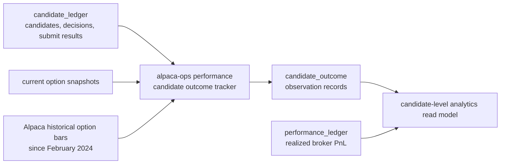

# Alpaca Candidate Outcome Analytics

Status: implemented read-model contract.

This document defines how to read and aggregate Alpaca candidate outcome records. The goal is to
make strategy review boring and defensible: one candidate should not silently become four samples
because it was observed at four buckets, and historical bar marks should not be mistaken for
execution-quality fills.

## Boundary

Candidate outcomes are analytical observations derived from `candidate_ledger` records. They are
not broker fills, strategy state, or order truth. Realized PnL remains owned by broker activity
reconstruction and the `performance_ledger`.

## Source Record

Storage table: `candidate_outcome`.

Owner: Alpaca options runtime reporting path.

Write path: `alpaca-ops performance` through `track_candidate_outcomes`.

Key fields:

| Field | Meaning |
| --- | --- |
| `candidate_identity_key` | Stable candidate identity: strategy, underlying, and option symbols. |
| `trade_date` | Candidate-ledger trade date. |
| `observation_bucket` | Observation horizon such as `plus_1h`, `same_day_close`, `next_day`, `expiration_risk`, or `virtual_close`. |
| `mark_source` | `snapshot` for current option snapshots, `historical_bar` for historical option-bar fallback. |
| `mark_ts_utc` | Timestamp of the historical bar mark when `mark_source = historical_bar`; absent for snapshots. |
| `entry_net_premium` | Candidate entry premium from the candidate ledger. Credits and debits are stored as positive magnitudes. |
| `close_net_premium` | Analytical close mark for the candidate package. |
| `hypothetical_pnl` | Analytical PnL for the candidate quantity. |
| `was_selected`, `was_submitted`, `was_traded`, `virtual_trade` | Live decision and broker-submission classifications copied from ledger evidence. |
| `quote_warnings` | Missing quote/bar warnings that make the observation lower quality. |

Record key today is `trade_date|candidate_identity_key|observation_bucket`. That means the table is
an observation table, not a candidate table.

## Mark Semantics

`snapshot` marks use current option bid/ask snapshots and are closest to a current liquidation
estimate. They are still marks, not fills.

`historical_bar` marks use option bar close prices at the latest available bar between candidate
timestamp and the configured lookahead target. Historical bars improve coverage for older
candidate-ledger dates and off-market reports, but they are trade aggregates rather than bid/ask
quotes. Treat them as research marks only.

Do not compare `snapshot` and `historical_bar` outcomes as if they have identical liquidity or fill
quality. Segment by `mark_source` whenever evaluating strategy performance.

## Analytics Grains

Use three explicit grains:

| Grain | Key | Use |
| --- | --- | --- |
| Candidate | `account_id`, `trade_date`, `candidate_identity_key` | Count unique opportunities and selection rates. |
| Candidate horizon | `account_id`, `trade_date`, `candidate_identity_key`, `observation_bucket` | Compare outcomes at specific horizons. |
| Realized trade | `performance_ledger.record_key` | Broker-backed realized PnL. |

Never use raw `candidate_outcome.records` as sample count without naming the grain. A single
candidate can produce multiple outcome records because each observation bucket is a separate row.

## Canonical Reporting Rules

For candidate-level research:

- Pick one canonical horizon before aggregating. Default to `plus_1h` for intraday review and
  `next_day` for overnight review.
- Deduplicate by `candidate_identity_key` within account and trade date.
- Segment selected, submitted, rejected, virtual, and traded candidates separately.
- Segment `mark_source`; do not blend snapshot and historical-bar marks unless the report clearly
  names the blend.
- Exclude records with `quote_warnings` from primary PnL summaries, or report them as a separate
  quality bucket.

For strategy tuning:

- Prefer selected/submitted candidates over all ranked candidates when evaluating live strategy
  behavior.
- Use all ranked candidates for threshold-search or opportunity-shape research only.
- Do not tune entry thresholds from historical-bar PnL alone. It can identify poor candidate
  regions, but it is not an execution simulator.

For broker performance:

- Use `performance_ledger`, not `candidate_outcome`.
- Treat candidate outcomes as explanatory evidence around decisions the strategy could have taken.

## Data Quality Checks

Minimum checks before using a range for research:

- Candidate coverage: candidates read from `candidate_ledger` versus candidates with an outcome at
  the target horizon.
- Mark coverage: counts by `mark_source`.
- Missing mark count: candidates skipped because neither snapshots nor historical bars produced a
  complete package mark.
- Warning rate: records with `quote_warnings`.
- Duplicate semantics: unique candidates versus horizon records.
- Time sanity: `mark_ts_utc` is at or after candidate `ts_utc` and no later than the configured
  lookahead target.

## Operator Read Model

`alpaca-ops performance` and `alpaca-control performance` expose the candidate-outcome read model
from Postgres. Operators should use that output instead of interpreting raw rows. The read model
produces:

- Unique candidate counts by account, date, strategy, underlying, selected/submitted/traded state,
  and mark source.
- Horizon-specific PnL summaries with no accidental cross-bucket double counting.
- Coverage and warning summaries.
- A clear separation between analytical outcomes and realized broker PnL.

Top-level `candidate_outcomes.records` is the observation-row count. Top-level
`candidate_outcomes.candidates` is the unique candidate count across all observation buckets in the
date range. Bucket, strategy, mark-source, selected, submitted, rejected, virtual, and virtual-close
summaries also expose both `records` and `candidates` fields.

`hypothetical_pnl` is still horizon-record PnL. Do not treat the top-level value as candidate-level
PnL when multiple observation buckets are present. Use `by_bucket` for horizon-specific PnL, and
choose a canonical bucket before comparing candidate-level strategy alternatives.

`records_with_warnings` and `warning_rate` surface quote/bar quality. Segment or exclude warning
records before using outcomes for threshold tuning.

Use `--no-track-candidate-outcomes` when you want a read-only report over already persisted
candidate-outcome rows. Without that flag, the performance command first attempts to track outcomes
for the configured trade date and then reports the updated read model.

This can remain in Postgres initially because `candidate_outcome` is small operational/research
evidence. If outcome volume grows enough to need analytical scans across many months and accounts,
mirror the records into ClickHouse as a reporting copy only. Postgres remains the source of truth.

## Non-Goals

- Do not make candidate outcomes a fill simulator.
- Do not move broker truth out of `performance_ledger`.
- Do not build a sidecar replay daemon.
- Do not let ClickHouse become strategy-state or broker-evidence truth.
