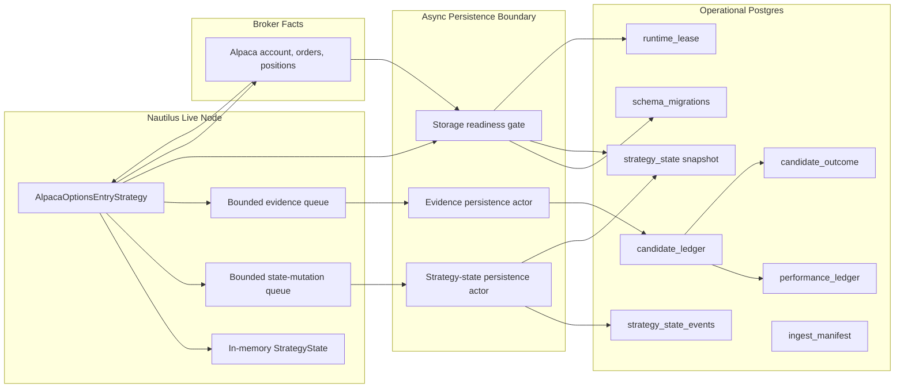

# Alpaca Operational Postgres Plan

Status: planned.

This document refines the Postgres side of the Alpaca runtime after the Nautilus-native entry
strategy cutover work. It covers operational state, evidence ledgers, migrations, and live-submit
readiness. It does not cover high-volume market data; that belongs to
`market_data_warehouse_workstream.md`.

## Design Position

Postgres remains the Alpaca operational control plane. It is the right store for small mutable
records, evidence ledgers, transactional updates, restart continuity, and operator reports.

Postgres should not become a market-data warehouse. Quotes, trades, bars, Greeks, scanner feature
time series, and raw vendor market-data archives belong in `ParquetDataCatalog` and ClickHouse.

The key refinement is to make strategy state durable without turning the adapter into a second
product database:

- Keep `strategy_state` as a compact JSONB snapshot for fast load/admission.
- Add an append-only `strategy_state_events` table for audit, idempotency, and rebuild.
- Write state mutations through an async persistence sink, not directly from synchronous strategy
  callbacks.
- Add schema migrations and storage readiness gates before paper submission is enabled.
- Retire or narrow `backtest_market_cache` once catalog and ClickHouse cover market-data use cases.

## Current State

Existing tables are created inline by `StorageRepository::init_schema`:

- `strategy_state`: one JSONB snapshot per account.
- `candidate_ledger`: append-only candidate, decision, alert, and submit-result records.
- `performance_ledger`: upserted realized performance records.
- `candidate_outcome`: upserted candidate outcome records.
- `backtest_market_cache`: broad JSONB cache for backtest market payloads.

This is acceptable for the current account-engine loop, but it is not enough for live strategy
cutover because `strategy_state` is currently last-write-wins and there is no append-only state
mutation record.

## Target Architecture



The strategy updates in-memory state first so the running process protects itself immediately.
Durability then flows through explicit async persistence actors. State persistence is the first
actor to implement because it gates live submit; candidate evidence can move behind the same
boundary once state durability is in place. If the state sink becomes unhealthy, the runtime should
deny new live submissions and surface an operator event. Startup reconciliation remains mandatory
before enabling live submit because a process can always crash between broker acceptance and durable
write completion.

## Data Ownership

| Table | Owner | Purpose | Shape |
| --- | --- | --- | --- |
| `schema_migrations` | Alpaca storage | Versioned schema contract for the operational store. | One row per applied migration with checksum. |
| `strategy_state` | Alpaca runtime | Current restart/admission snapshot per account. | One row per account, JSONB state, version metadata. |
| `strategy_state_events` | Alpaca runtime | Append-only state mutation audit and idempotency ledger. | One row per accepted/rejected/closed/reconciled state mutation. |
| `candidate_ledger` | Scanner/strategy evidence | Candidate, block, decision, alert, and submit-result evidence. | Append-only JSONB records with typed columns for common filters. |
| `performance_ledger` | Reporting | Realized performance report inputs. | Upsert by stable record key. |
| `candidate_outcome` | Reporting/research | Candidate outcome projections. | Upsert by stable record key. |
| `ingest_manifest` | Warehouse workstream | Small dual-write/backfill control records. | Relational run/range metadata, not market payloads. |
| `runtime_lease` | Live-submit safety | Exclusive active writer/submitter per account. | One row per account with holder and expiry. |

## Proposed Schema Changes

Use versioned SQL migrations instead of growing the inline `CREATE TABLE IF NOT EXISTS` block.
The first migration can preserve the existing tables and add missing metadata.

### Schema Migrations

```sql
CREATE TABLE IF NOT EXISTS "{schema}".schema_migrations (
    version BIGINT PRIMARY KEY,
    description TEXT NOT NULL,
    checksum TEXT NOT NULL,
    applied_at TIMESTAMPTZ NOT NULL DEFAULT NOW()
);
```

### Strategy State Snapshot

Keep the snapshot JSONB, but add concurrency and writer metadata:

```sql
ALTER TABLE "{schema}".strategy_state
    ADD COLUMN IF NOT EXISTS version BIGINT NOT NULL DEFAULT 0,
    ADD COLUMN IF NOT EXISTS writer_id TEXT,
    ADD COLUMN IF NOT EXISTS run_id UUID,
    ADD COLUMN IF NOT EXISTS last_event_id UUID;

CREATE INDEX IF NOT EXISTS "ix_strategy_state_updated"
    ON "{schema}".strategy_state (updated_at);
```

Write contract:

- Load snapshot before strategy construction.
- Persist with optimistic version checks or a transaction that locks the account row.
- Increment `version` on every successful state mutation.
- Store `last_event_id` for quick operator diagnostics.
- Continue writing the local JSON mirror as a recovery/debug artifact, not as the source of truth
  when Postgres is enabled.

### Strategy State Events

```sql
CREATE TABLE IF NOT EXISTS "{schema}".strategy_state_events (
    id BIGSERIAL PRIMARY KEY,
    account_id TEXT NOT NULL,
    event_id UUID NOT NULL,
    event_type TEXT NOT NULL,
    strategy TEXT,
    underlying TEXT,
    trade_date DATE,
    order_list_id TEXT,
    client_order_id TEXT,
    venue_order_id TEXT,
    ts_event TIMESTAMPTZ,
    ts_recorded TIMESTAMPTZ NOT NULL DEFAULT NOW(),
    payload JSONB NOT NULL,
    CONSTRAINT uq_strategy_state_events_event UNIQUE (account_id, event_id)
);

CREATE INDEX IF NOT EXISTS "ix_strategy_state_events_account_date"
    ON "{schema}".strategy_state_events (account_id, trade_date, ts_recorded);

CREATE INDEX IF NOT EXISTS "ix_strategy_state_events_order_list"
    ON "{schema}".strategy_state_events (account_id, order_list_id);

CREATE INDEX IF NOT EXISTS "ix_strategy_state_events_client_order"
    ON "{schema}".strategy_state_events (account_id, client_order_id);
```

Initial event types:

- `entry_submitted`
- `entry_accepted`
- `entry_rejected`
- `entry_denied`
- `entry_reconciled`
- `entry_closed`
- `entry_canceled`
- `close_submitted`
- `close_reconciled`

The event table is intentionally not a fully normalized trading model. It is an operational event
ledger for the Alpaca strategy state snapshot.

### Runtime Lease

The existing file lock is useful for installed user services, but Docker and future node shapes
need a DB-visible submit guard.

```sql
CREATE TABLE IF NOT EXISTS "{schema}".runtime_lease (
    account_id TEXT PRIMARY KEY,
    holder_id TEXT NOT NULL,
    run_id UUID NOT NULL,
    service_name TEXT,
    mode TEXT NOT NULL,
    acquired_at TIMESTAMPTZ NOT NULL DEFAULT NOW(),
    heartbeat_at TIMESTAMPTZ NOT NULL DEFAULT NOW(),
    expires_at TIMESTAMPTZ NOT NULL
);
```

Live submit readiness should require an active lease for the account. Read-only scans and dry-run
cutover proof do not need the lease.

### Ingest Manifest

Market-data payloads do not belong in Postgres, but small warehouse control records do:

```sql
CREATE TABLE IF NOT EXISTS "{schema}".ingest_manifest (
    id BIGSERIAL PRIMARY KEY,
    dataset TEXT NOT NULL,
    source TEXT NOT NULL,
    instrument_id TEXT,
    universe_key TEXT,
    start_ts_event TIMESTAMPTZ NOT NULL,
    end_ts_event TIMESTAMPTZ NOT NULL,
    ingest_run_id UUID NOT NULL,
    catalog_status TEXT NOT NULL,
    clickhouse_status TEXT NOT NULL,
    row_count BIGINT,
    checksum TEXT,
    first_ts_event TIMESTAMPTZ,
    last_ts_event TIMESTAMPTZ,
    completed_at TIMESTAMPTZ,
    created_at TIMESTAMPTZ NOT NULL DEFAULT NOW()
);

CREATE UNIQUE INDEX IF NOT EXISTS "uq_ingest_manifest_range"
    ON "{schema}".ingest_manifest (
        dataset,
        source,
        COALESCE(instrument_id, ''),
        COALESCE(universe_key, ''),
        start_ts_event,
        end_ts_event
    );
```

This table belongs to the warehouse workstream, but it should live in the operational Postgres
schema because it is small control state.

## Write Contracts

### Strategy-State Mutation

1. Strategy callback receives a Nautilus order event.
2. Strategy updates in-memory `StrategyState`.
3. Strategy builds a `StrategyStateMutation` containing:
   - stable `event_id`
   - event type
   - account/run/writer metadata
   - selected entry identifiers
   - new state snapshot
   - evidence payload
4. Strategy enqueues the mutation into a bounded persistence queue.
5. Async sink writes event and snapshot in one transaction.
6. Sink updates health/readiness.

The transaction must be idempotent. Replaying the same `event_id` should not duplicate
`strategy_state_events`, and it should leave the snapshot consistent.

### Candidate Evidence

Candidate evidence can stay in `candidate_ledger`, but scanner/strategy code should not own direct
SQL. For the Nautilus strategy path, prefer the same persistence boundary pattern:

- publish decision/evidence records to a sink;
- sink writes `candidate_ledger`;
- strategy remains focused on admission and order submission.

This can come after durable state, because durable state is the submit cutover blocker.

### Failure Policy

| Failure | Policy |
| --- | --- |
| Storage unavailable at startup and live submit requested | Fail closed before node starts submitting. |
| Storage unavailable at startup and dry-run scan requested | Allow dry-run with clear operator warning. |
| Mutation queue full | Deny new entries and emit an operator event. |
| Mutation write fails after broker acceptance | Mark sink unhealthy, deny new entries, keep in-memory state, rely on startup reconciliation on restart. |
| Snapshot version conflict | Deny new entries and require operator/reconciliation action. |
| Duplicate event ID | Treat as idempotent success after verifying snapshot/version state. |

## Readiness Gate For Paper Submit

`ALPACA_OPTIONS_LIVE_ENTRY_SUBMIT_ENABLED=true` should require all of the following:

- Postgres storage configured and reachable.
- Required migrations applied.
- Strategy state loaded from Postgres.
- Local JSON mirror updated from Postgres at startup.
- Runtime lease acquired for the account.
- Startup broker reconciliation completed.
- Persistence sink healthy.
- Account/admission broker checks complete.

If any item fails, the node may continue scanning, but it must not submit entries.

## Phased Work Plan

### Phase 1: Migrations And Repository Contract

- Add versioned SQL migrations for the existing Alpaca schema.
- Add `schema_migrations`, state metadata columns, `strategy_state_events`, and `runtime_lease`.
- Keep inline schema creation only as a bootstrap that applies migrations, or replace it outright
  with the migration runner.
- Add repository functions for transactional state event + snapshot writes.

Done when a local Postgres can initialize, report migration version, load existing state rows, and
persist one synthetic state event idempotently.

### Phase 2: Strategy-State Persistence Sink

- Add a focused async sink for Alpaca strategy-state mutations.
- Strategy callbacks keep updating memory immediately and enqueue mutations.
- Sink serializes writes per account.
- Sink exposes health to the live node and operator logs.

Done when accepted/rejected strategy order events persist an event row and updated snapshot without
blocking synchronous strategy callbacks.

### Phase 3: Submit Readiness Gate

- Add storage readiness checks to the live node.
- Require storage-backed state and healthy sink when `ALPACA_OPTIONS_LIVE_ENTRY_SUBMIT_ENABLED=true`.
- Acquire or validate the runtime lease before live submission.
- Emit a clear reason when submit remains disabled.

Done when paper submit cannot be enabled with missing storage, stale migrations, failed lease, or
unhealthy sink.

### Phase 4: Startup Reconciliation

- Load persisted state.
- Query broker orders/positions/account state.
- Reconcile pending, partially accepted, terminally rejected, and externally closed entries.
- Persist reconciliation events and updated snapshot.

Done when restart cannot double-submit an entry that was accepted before a crash.

### Phase 5: Candidate Evidence Sink

- Move Nautilus strategy decision/dry-run/block evidence into a persistence sink.
- Preserve the current `candidate_ledger` payload contract.
- Ensure dry-runs still record `submission_disabled`.

Done when the strategy path emits decision evidence equivalent to the account-engine path without
direct SQL in strategy callbacks.

### Phase 6: Postgres Slimming

- Stop adding new use cases to `backtest_market_cache`.
- Move market-data-shaped caches to catalog/ClickHouse.
- Rename or replace any remaining tiny operational checkpoint use case.
- Keep optional ClickHouse mirrors of ledgers analytical only; Postgres remains source of truth.

Done when Postgres contains operational state, evidence, reports, outcomes, and manifests only.

## Non-Goals

- Do not normalize every strategy-state entry into relational tables yet.
- Do not make ClickHouse the source of truth for strategy state or broker evidence.
- Do not build a generic storage framework before the Alpaca state sink proves the pattern.
- Do not block synchronous Nautilus callbacks on async database writes.
- Do not allow live submission with best-effort-only persistence.

## Recommended Next Step

Implement Phase 1 first. It is the smallest safe step and gives later strategy work a durable
contract:

1. Add migration files.
2. Add migration runner to `StorageRepository`.
3. Add `strategy_state_events`.
4. Add snapshot version metadata.
5. Add a transactional repository method for one state event plus one snapshot update.

Only after that should the strategy persistence sink be wired into the live node.
