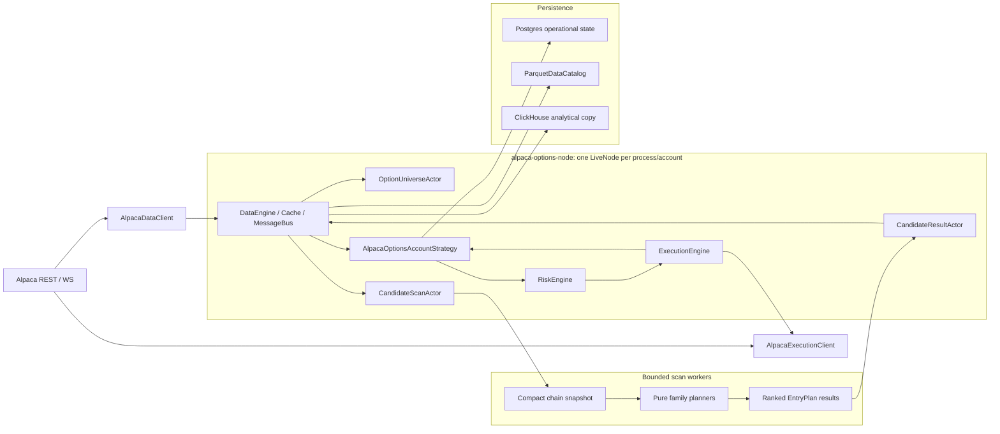

# Alpaca Options Account-Strategy Architecture

Status: proposed target architecture for `nt-1ny`; first implementation work starts with
`nt-1ny.1`.

This document records the target runtime shape for the Alpaca options system after the fork's
Nautilus-native cutover. It is intentionally narrower than the historical migration plans: the
question here is how the live order-capable runtime should be structured so it follows Nautilus
patterns under load and after restart.

## Decision

Keep `alpaca-options-node` as a Nautilus `LiveNode` process with Alpaca data and execution clients.
Inside that node, use lightweight actors for data orchestration and one account-level order-owning
strategy for broker submission, close management, account-level admission, and durable state.

Do not split every strategy family into an independent order-submitting strategy yet. The live
runtime currently has one account risk budget, one runtime lease, one operational state projection,
one daily submit count, and shared close/lifecycle handling. Splitting order ownership before those
boundaries split would make duplicate exposure and reconciliation harder to reason about.

Do split the current monolithic strategy implementation into pure strategy-family planners and
runtime-owned orchestration:

- `put_credit`, `call_credit`, `iron_condor`, `debit_spread`, and `naked_option` planners produce
  entry plans.
- The account strategy arbitrates those plans, applies state and risk gates, and submits orders.
- The Alpaca execution client remains the only place that expands Nautilus orders into Alpaca
  broker payloads.

## Context

Nautilus expects live systems to run as standalone trading nodes. Data enters through adapter data
clients, is routed by `DataEngine` and `MessageBus`, and reaches actors or strategies through
callbacks. Orders leave strategies through Nautilus order APIs, pass the risk and execution engines,
and are translated by execution clients.

The fork is already aligned with this at the outer boundary:

- `crates/adapters/alpaca/bin/options_node.rs` builds the live node and registers Alpaca clients.
- `crates/adapters/alpaca/src/candidate_scan_actor.rs` subscribes to option chains and publishes
  candidate data.
- `crates/adapters/alpaca/src/options_account_strategy.rs` consumes candidates and submits through Nautilus
  strategy APIs.
- `crates/adapters/alpaca/src/execution.rs` maps Nautilus orders to Alpaca execution payloads.
- `crates/adapters/alpaca/src/spread_plan.rs` is moving spread identity toward Nautilus
  `OptionSpread`.

The remaining design flaw is internal: too many responsibilities live in the Alpaca strategy and
candidate actor. Under wider option chains, the highest-risk problem is doing scan/rank work inside
Nautilus callbacks, where blocking delays order and data handling for the node.

## Target Runtime



## Component Responsibilities

`alpaca-options-node` owns process assembly: config loading, account preflight, operational-store
readiness, runtime lease acquisition, node construction, and graceful shutdown.

`AlpacaDataClient` owns Alpaca market-data access and converts venue data into Nautilus instruments,
quotes, bars, Greeks, and option-chain inputs. It must not embed strategy family policy.

`CandidateScanActor` owns Nautilus subscriptions and scan job orchestration. Its callback work must
stay bounded: capture or normalize the current chain snapshot, enqueue a scan job, emit queue
diagnostics, and return.

`Bounded scan workers` own CPU-heavy ranking. They receive immutable scan inputs, execute pure
family planners, and return timestamped results. They do not access Alpaca credentials, submit
orders, or mutate strategy state.

`CandidateResultActor` owns result publication back onto the Nautilus data path. It drops stale
results, records scanner evidence, and publishes `OptionsCandidateData` custom data.

`AlpacaOptionsAccountStrategy` owns order-capable behavior: selected-plan arbitration, entry
admission, open-order submission, close management, lifecycle blocks, order/position event handling,
and durable state projection.

`Family planners` own pure strategy logic. They take normalized chain data, profile config, regime
context, and optional account-independent ranking context, then produce `EntryPlan` values.

`AlpacaExecutionClient` owns broker translation. For spreads, the target path is one Nautilus
`OptionSpread` limit order expanded to Alpaca MLeg payloads.

## Storage Ownership

Nautilus cache and execution state are the live source for orders, positions, accounts, fills, and
loaded instruments inside the running node.

Postgres is the operational control plane. It stores runtime leases, normalized strategy-state rows,
state events, candidate evidence, performance ledgers, and candidate outcomes. It should not store
bulk quotes, bars, Greeks, or market-data-shaped feature series.

`ParquetDataCatalog` remains the replay and backtest-compatible market-data store.

ClickHouse is an analytical market-data warehouse and optional feature/read acceleration path. It
is not part of order submission, broker truth, or realized PnL.

## Current-To-Target Mapping

| Current area | Target |
| --- | --- |
| `options_node.rs` | Keep as process assembly; shrink business logic over time. |
| `candidate_scan_actor.rs` | Keep as subscription actor; move scan/rank work to bounded workers. |
| `options_account_strategy.rs` | Split into account strategy, entry admission, close manager, state projector, and event handlers. |
| `strategy.rs` and `option_chain_candidates.rs` | Move pure candidate ranking toward source-neutral planner modules. |
| `options_runtime/config.rs` | Replace family string lists with explicit profile strategy blocks. |
| `runtime.rs` strategy state | Replace the account JSONB snapshot table with normalized strategy_state rows plus account metadata and broker evidence. |
| `spread_plan.rs` and `execution.rs` | Continue under `nt-ups`; this lane owns native `OptionSpread` cutover. |

## Non-Goals

- Do not create a second live trading loop outside Nautilus.
- Do not restore retired direct Alpaca submit binaries or strategy loops.
- Do not split into many order-submitting strategies until risk budgets, leases, and account
  ownership are separate.
- Do not put ClickHouse on the order path.
- Do not keep permanent compatibility aliases for replaced runtime config names.

## Migration Phases

1. ADR and tracker setup. Record this architecture, link `nt-ups`, and keep active docs aligned.
2. Bounded scan pipeline. Move heavy `on_option_chain` scan/rank work off the Nautilus callback
   thread and add stale-result dropping.
3. Strategy module split. Extract account strategy shell, family planners, close manager, state
   projector, and event handlers without changing broker behavior.
4. Profile strategy blocks. Replace `strategy_families` and `dry_run_families` with explicit
   per-profile strategy blocks.
5. Strategy-state row replacement. Migrate operational state in place so `strategy_state` stores
   normalized order-state rows and `strategy_broker_leg_evidence` stores broker evidence, with
   backup and rollback instructions.
6. Validation and cleanup. Keep operators on the replacement read model and retire displaced
   compatibility paths after live dry-run and paper proof.

## Validation Gates

For code changes in the Alpaca runtime:

```bash
cargo fmt -p nautilus-alpaca
cargo test -p nautilus-alpaca --features live --lib
cargo check -p nautilus-alpaca --features live --bins
cargo check -p nautilus-cli --features alpaca --bin nautilus
```

For runtime proof, use the Docker/local commands documented in `AGENTS.md` and report broker
account/orders/positions after the run. Broker submit/cancel smoke tests remain intentional
market-hours actions and must cancel accepted smoke orders unless explicitly left open.

## Related Work

- `nt-1ny`: rearchitecture epic.
- `nt-1ny.1`: this ADR/design work.
- `nt-ups`: Nautilus-native `OptionSpread` cutover lane.
- `docs/developer_guide/operational_postgres_plan.md`: operational store boundary.
- `docs/developer_guide/market_data_warehouse_workstream.md`: Parquet/ClickHouse boundary.
