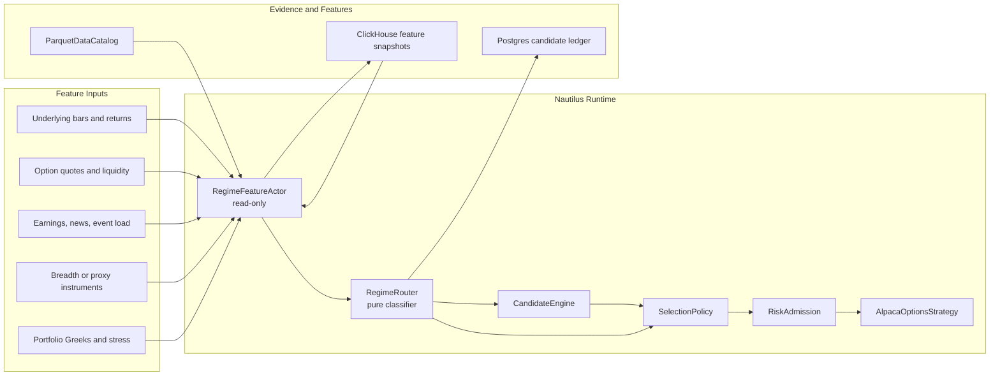

# Alpaca Regime Router

Status: proposed focused architecture.

This document defines the target architecture for Alpaca option strategy regime routing. It refines
the regime-router slice described in the Nautilus-native candidate scanning architecture and the
Alpaca production roadmap.

The goal is not to create a generic Nautilus regime framework. The goal is to give the Alpaca
options runtime a deterministic, replayable routing layer that can adjust which strategy families
are eligible under current market conditions.

## Boundary

The regime router is a **decision input**, not an execution system.

It should:

- Classify current market context from normalized features.
- Produce a `RegimeContext` with label, confidence, freshness, and explanation codes.
- Route strategy families by assigning weights, tightening thresholds, or blocking families.
- Feed the candidate engine and selection policy.
- Record evidence so candidate outcomes can be analyzed by regime.

It should not:

- Call Alpaca directly.
- Submit, cancel, or modify orders.
- Mutate strategy state.
- Replace risk admission.
- Become a second scanner loop.
- Depend on opaque ML models in v1.

## Fit With Nautilus

Nautilus already supports strategy-local regime filters through indicators and strategy code. The
Hurst/VPIN directional example is the useful precedent: it computes a Hurst regime filter from bars,
combines it with flow information, and uses the result to gate entries.

For Alpaca options, that pattern should become a reusable strategy-family router:

- `RegimeFeatureActor`: read-only actor that computes or loads regime features.
- `RegimeRouter`: pure classifier that turns features into routing policy.
- `CandidateEngine`: ranks candidates using `RegimeContext`.
- `SelectionPolicy`: applies strategy-family weights, blocks, or dry-run routing.
- `RiskAdmission`: remains the final gate before any order submission.
- `CandidateLedger`: records regime evidence and routing decisions.



## Runtime Flow

```mermaid
sequenceDiagram
    participant Node as TradingNode
    participant Data as DataEngine
    participant Actor as RegimeFeatureActor
    participant Router as RegimeRouter
    participant Candidate as CandidateEngine
    participant Selection as SelectionPolicy
    participant Risk as RiskAdmission
    participant Ledger as CandidateLedger

    Node->>Data: stream bars, quotes, greeks, events
    Data->>Actor: normalized market updates
    Actor->>Actor: compute feature snapshot
    Actor->>Router: RegimeInput
    Router-->>Actor: RegimeContext
    Actor->>Ledger: record feature freshness and regime
    Router->>Candidate: regime context
    Candidate-->>Selection: ranked candidates
    Router->>Selection: family weights and blocks
    Selection->>Risk: selected candidate or no-trade decision
    Risk-->>Ledger: blocked, dry-run, or admitted evidence
```

## Regime Labels

Start with a small deterministic label set. Labels should be stable enough for ledgers, reports, and
outcome analysis.

| Regime | Meaning | Strategy routing |
| --- | --- | --- |
| `quiet_mean_reverting` | Lower realized volatility, stable breadth, contained gaps, normal event load. | Favor iron condors and conservative credit spreads. Down-rank long-premium directional entries. |
| `directional_trend` | Persistent underlying trend, directional breadth, controlled but directional volatility. | Favor debit spreads or defined-risk directional credit. Down-rank neutral iron condors. |
| `high_vol_chop` | High realized range, unstable direction, wide spreads, noisy intraday reversals. | Reduce size, demand better liquidity and edge, favor defined-risk only. |
| `event_shock` | Earnings, news, gap, volatility spike, or market-wide stress signal dominates. | Block naked exposure, reduce or block new entries, prefer management or flattening decisions. |
| `liquidity_stressed` | Option quote age, spreads, volume/open-interest, or fill-quality proxies degrade. | Down-rank all entries or require stricter limit and repricing behavior. |
| `unknown` | Features are stale, missing, or contradictory. | Fail conservative: dry-run only, reduce size, or block undefined-risk strategies. |

The router may carry secondary tags such as `earnings_window`, `iv_spike`, `wide_quotes`,
`gap_open`, or `trend_reversal`, but the primary label should remain one of the stable values above.

## Inputs

Keep inputs explicit and small. The router should receive a complete input object rather than
querying services internally.

```text
RegimeInput
  as_of_ts
  underlying_symbol
  underlying bars and returns
  realized volatility and gap metrics
  trend and mean-reversion indicators
  market breadth or proxy instruments
  option-implied volatility and skew proxies
  option liquidity and quote freshness
  external event load, such as earnings and known news
  optional portfolio Greek/stress summary
```

Feature groups:

| Group | Examples | Source |
| --- | --- | --- |
| Trend | Hurst, moving-average slope, return persistence, directional breadth proxy. | Nautilus indicators, bars, catalog, ClickHouse. |
| Volatility | Realized volatility, ATR/range, gap size, intraday range expansion. | Bars, quote history, catalog, ClickHouse. |
| Option vol | IV level, IV change, skew, term proxy, IV versus realized proxy. | `OptionGreeks`, option snapshots, ClickHouse. |
| Liquidity | Quote age, spread width, quote depth proxy, volume, open interest, fill-quality proxy. | Option chain, quote stream, ledgers, ClickHouse. |
| Event load | Earnings timing, known events, market-wide shock signals. | External signals, earnings cache/feed. |
| Portfolio | Net delta, gamma, vega, theta, stress scenarios, buying-power pressure. | Portfolio, performance state, risk layer. |

## Outputs

```text
RegimeContext
  label
  confidence
  as_of_ts
  feature_freshness
  feature_version
  strategy_family_weights
  blocked_strategy_families
  threshold_adjustments
  dry_run_only
  explanation_codes
```

`strategy_family_weights` should adjust opportunity ranking. `blocked_strategy_families` should
remove strategy families before selection. `threshold_adjustments` can tighten minimum edge,
liquidity, spread width, DTE, delta, or quote-freshness requirements.

## Routing Policy

The router should route strategy families, not individual orders.

Suggested family behavior:

| Family | Favor When | Down-Rank Or Block When |
| --- | --- | --- |
| Iron condors | `quiet_mean_reverting`, stable liquidity, no major event shock. | `directional_trend`, `event_shock`, stale features, gap expansion. |
| Credit spreads | Quiet to moderate regimes with acceptable edge and liquidity. | `event_shock`, liquidity stress, high-volatility chop without enough premium. |
| Debit spreads | `directional_trend`, controlled liquidity, clear directional context. | Quiet mean reversion, liquidity stress, event shock unless explicitly configured. |
| Naked puts | Quiet or moderate bullish context, strong account approval, conservative stress. | `event_shock`, `unknown`, liquidity stress, high portfolio downside exposure. |
| Naked calls | Rare; only under explicit approval and strict trend/vol/stress constraints. | Default blocked in `event_shock`, `unknown`, high vol, or elevated assignment risk. |

Risk admission remains the final gate. The router can say "this family is appropriate"; it cannot
override account capability, buying-power, Greek/stress, expiration, quote freshness, or broker
submission gates.

## Storage And Evidence

Use the same clean storage boundary as the warehouse workstream:

- Postgres candidate ledgers are the operational source of truth for decisions.
- ClickHouse stores high-volume feature snapshots and analytical mirrors once available.
- `ParquetDataCatalog` remains the replay/backtest market-data authority.

Every scan should record:

- Regime label and confidence.
- Feature version.
- Feature timestamps and freshness.
- Routing action: allowed, down-ranked, blocked, dry-run only, threshold-adjusted.
- Explanation codes.
- Strategy-family weights and blocks.
- Candidate identifiers affected by the regime decision.

Example evidence shape:

```text
regime_decision
  account_id
  scan_id
  ts_utc
  underlying
  label
  confidence
  feature_version
  feature_freshness
  strategy_family_weights
  blocked_strategy_families
  threshold_adjustments
  explanation_codes
```

## Failure Policy

Regime failures should fail conservative.

| Condition | Behavior |
| --- | --- |
| Missing required features | Label `unknown`; block undefined-risk strategies. |
| Stale feature snapshot | Label `unknown` or keep previous label only if freshness policy allows it; record stale evidence. |
| Conflicting signals | Prefer `high_vol_chop` or `unknown`; reduce size and demand stronger edge. |
| ClickHouse unavailable | Use live/cache/catalog features that are available; do not block trading solely because analytics storage is down unless the configured strategy requires those features. |
| Event feed unavailable | Treat event load as unknown and block strategies that require event clearance. |

## Implementation Slices

| Slice | Outcome | Work | Done when |
| --- | --- | --- | --- |
| 1. Contracts | Pure router API. | Add `RegimeInput`, `RegimeContext`, labels, explanation codes, and routing policy types. | Unit-level callers can classify synthetic feature snapshots without venue I/O. |
| 2. Feature snapshot | Read-only feature production. | Build a `RegimeFeatureActor` or service that computes v1 feature snapshots from bars, option-chain state, external signals, and optional ClickHouse/catalog history. | Operator diagnostics can display feature freshness and current regime. |
| 3. Candidate integration | Ranking receives regime context. | Add regime context to candidate input and selection policy. | Dry-run scans record regime decisions without changing order behavior. |
| 4. Family routing | Strategy families are weighted or blocked. | Apply v1 routing policy to iron condors, credit/debit spreads, and undefined-risk strategies. | Candidate ledgers show which families were allowed, down-ranked, or blocked. |
| 5. Replay validation | Outcome analysis by regime. | Replay candidate ledgers against historical market data and feature snapshots. | Reports show performance by regime, strategy family, and explanation code. |
| 6. Live enablement | Controlled production use. | Enable routing in paper mode, then promote specific blocks/weights once evidence supports them. | Live/paper operator status reports regime, freshness, and routing action. |

## Open Questions

- Which underlying universe is v1: SPY only, index ETFs, or all enabled option underlyings?
- Which breadth proxy should v1 use before a broader market-data universe exists?
- How much portfolio Greek/stress context belongs in the router versus only in risk admission?
- Should `unknown` mean dry-run only or hard block for defined-risk strategies?
- Which feature snapshots are small enough for Postgres evidence versus ClickHouse-only analytics?

## Design Preference

Keep v1 boring: deterministic, threshold-based, evidence-rich, and replayable. Let outcomes tell us
which labels and thresholds deserve more sophistication later.
