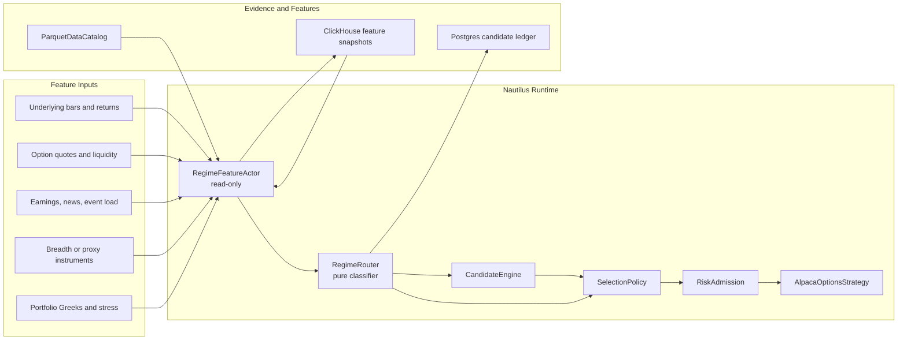

# Alpaca Regime Router

Status: v1 feature input contract defined; option-chain liquidity, cached underlying bar, derived
trend/vol, and approved earnings event-load snapshots implemented; fail-conservative router slice
implemented.

This document defines the target architecture for Alpaca option strategy regime routing. It refines
the regime-router slice described in the Nautilus-native candidate scanning architecture and the
Alpaca production roadmap.

The goal is not to create a generic Nautilus regime framework. The goal is to give the Alpaca
options runtime a deterministic, replayable routing layer that can adjust which strategy families
are eligible under current market conditions.

Current implementation boundary:

- Portfolio risk-capital admission, earnings event-shock blocks, fill-quality reporting, close
  reprice laddering, and replay decision explanations now exist in the Alpaca runtime/reporting
  paths.
- Those are prerequisite signals and safety gates, not a regime router.
- The live option-chain scanner now publishes `RegimeFeatureData` snapshots and a
  `regime_feature_snapshot` operator event from the same `OptionChainSlice` it already consumes for
  candidate scans. It enriches that slice with standard Nautilus underlying `Bar` cache data and the
  existing approved earnings event-shock input when those sources are available.
- The current implemented snapshot produces real option-liquidity values, cached underlying-bar
  coverage, derived trend/realized-vol values, and event-load values. Missing, stale, or degraded
  groups remain explicit in `feature_freshness` and `unavailable_features`; the router must not
  treat absent inputs as neutral.
- Runtime routing now consumes that feature contract, records compact `RegimeContext` evidence, and
  applies the fail-conservative policy: `unknown`, `dry_run_only`, and naked-option family blocks
  while required inputs are missing, stale, degraded, or not yet promoted to active thresholds. It
  does not produce directional or neutral labels from placeholder inputs.

## Boundary

The regime router is a **decision input**, not an execution system.

It should:

- Classify current market context from normalized features.
- Produce a `RegimeContext` with label, confidence, freshness, and explanation codes.
- Route strategy families by assigning weights, tightening thresholds, or blocking families.
- Feed the candidate engine and selection policy.
- Record evidence so candidate outcomes can be analyzed by regime.

It should not:

- Call Alpaca directly.
- Submit, cancel, or modify orders.
- Mutate strategy state.
- Replace risk admission.
- Become a second scanner loop.
- Depend on opaque ML models in v1.

## Fit With Nautilus

Nautilus already supports strategy-local regime filters through indicators and strategy code. The
Hurst/VPIN directional example is the useful precedent: it computes a Hurst regime filter from bars,
combines it with flow information, and uses the result to gate entries.

For Alpaca options, that pattern should become a reusable strategy-family router:

- `RegimeFeatureActor` or scanner-owned feature producer: read-only component that computes or loads
  regime features.
- `RegimeRouter`: pure classifier that turns features into routing policy.
- `CandidateEngine`: ranks candidates using `RegimeContext`.
- `SelectionPolicy`: applies strategy-family weights, blocks, or dry-run routing.
- `RiskAdmission`: remains the final gate before any order submission.
- `CandidateLedger`: records regime evidence and routing decisions.



## Runtime Flow

```mermaid
sequenceDiagram
    participant Node as TradingNode
    participant Data as DataEngine
    participant Actor as RegimeFeatureActor
    participant Router as RegimeRouter
    participant Candidate as CandidateEngine
    participant Selection as SelectionPolicy
    participant Risk as RiskAdmission
    participant Ledger as CandidateLedger

    Node->>Data: stream bars, quotes, greeks, events
    Data->>Actor: normalized market updates
    Actor->>Actor: compute feature snapshot
    Actor->>Router: RegimeInput
    Router-->>Actor: RegimeContext
    Actor->>Ledger: record feature freshness and regime
    Router->>Candidate: regime context
    Candidate-->>Selection: ranked candidates
    Router->>Selection: family weights and blocks
    Selection->>Risk: selected candidate or no-trade decision
    Risk-->>Ledger: blocked, dry-run, or admitted evidence
```

## Regime Labels

Start with a small deterministic label set. Labels should be stable enough for ledgers, reports, and
outcome analysis.

| Regime | Meaning | Strategy routing |
| --- | --- | --- |
| `quiet_mean_reverting` | Lower realized volatility, stable breadth, contained gaps, normal event load. | Favor iron condors and conservative credit spreads. Down-rank long-premium directional entries. |
| `directional_trend` | Persistent underlying trend, directional breadth, controlled but directional volatility. | Favor debit spreads or defined-risk directional credit. Down-rank neutral iron condors. |
| `high_vol_chop` | High realized range, unstable direction, wide spreads, noisy intraday reversals. | Reduce size, demand better liquidity and edge, favor defined-risk only. |
| `event_shock` | Earnings, news, gap, volatility spike, or market-wide stress signal dominates. | Block naked exposure, reduce or block new entries, prefer management or flattening decisions. |
| `liquidity_stressed` | Option quote age, spreads, volume/open-interest, or fill-quality proxies degrade. | Down-rank all entries or require stricter limit and repricing behavior. |
| `unknown` | Features are stale, missing, or contradictory. | Fail conservative: dry-run only, reduce size, or block undefined-risk strategies. |

The router may carry secondary tags such as `earnings_window`, `iv_spike`, `wide_quotes`,
`gap_open`, or `trend_reversal`, but the primary label should remain one of the stable values above.

## V1 Feature Input Contract

Keep inputs explicit and small. The router receives a complete `RegimeInput` value and must not
query services internally.

V1 is intentionally deterministic and source-limited. The approved inputs are:

| Group | Required for v1 | Approved source | Freshness rule |
| --- | --- | --- | --- |
| Underlying bars | Yes | Nautilus bar cache/stream, `ParquetDataCatalog`, or ClickHouse market-data warehouse. Current scanner requests daily underlying bars through standard Alpaca `request_bars`. | Live: last complete bar must satisfy the configured stale-after window. Replay: bar timestamp must be at or before decision time. |
| Underlying trend/vol features | Yes | Derived from approved bars. Current scanner derives close-to-close window return, mean return, and realized volatility from cached underlying bars. | Computed from the same fresh bar snapshot as the underlying bars. |
| Option liquidity snapshot | Yes for families under consideration | `OptionChainSlice`, Nautilus quote cache, Alpaca option snapshot adapter, or future option quote stream. | Quote age must be no older than `management.active_risk_quote_stale_secs` for selected legs when available; chain-level summaries must name their source timestamp. |
| Event load | Yes | Normalized earnings feed and event cache used by Alpaca admission. Current scanner reuses the configured approved earnings events and event-shock window. | Earnings data must cover the trade date and next configured event-block window. Unknown timing remains blocking unless explicitly allowed by the event policy. |
| Portfolio stress summary | Optional in v1 | Existing risk-capital state, strategy state, broker positions, and future Greek/stress governor output. | Must be produced in the same decision pass as risk admission if used for routing. |
| Breadth/proxy instruments | Optional in v1 | Configured ETF/index proxies from approved bar sources. | Use only when every configured proxy passes the bar freshness rule; otherwise mark the feature group unavailable. |
| Historical feature snapshot | Optional in v1 | ClickHouse or catalog-derived feature snapshots. | Replay: as-of timestamp must be no later than decision time. Live: snapshot must be current for the configured session. |

Disallowed v1 inputs:

- Ad hoc environment reads inside the router.
- Direct Alpaca HTTP calls from the router.
- Raw CSV parsing by the router.
- Placeholder, default, or hand-filled `neutral` labels.
- Model outputs without deterministic feature values and explanation codes.

### RegimeInput

```text
RegimeInput
  schema_version = 1
  feature_version
  as_of_ts_utc
  trade_date
  account_id
  underlyings
  bar_interval
  bar_source
  underlying_features
    return_5m
    return_30m
    return_1d
    realized_vol_30m
    realized_vol_1d
    intraday_range_pct
    gap_open_pct
    trend_score
    mean_reversion_score
  option_liquidity
    source
    quote_age_secs_max
    median_spread_pct
    wide_quote_ratio
    min_open_interest
    min_volume
    iv_rank_proxy
    skew_proxy
  event_load
    earnings_blocked_underlyings
    unknown_timing_underlyings
    market_event_codes
  portfolio_context
    risk_capital_used_pct
    active_entries
    net_delta_proxy
    stress_loss_pct
  feature_freshness
    group
    source
    latest_ts_utc
    age_secs
    status
  unavailable_features
```

`underlyings` should be the enabled option-underlying set for the current Alpaca runtime config, not
a hard-coded SPY-only universe. The feature actor may also compute aggregate context from configured
proxy instruments, but missing proxy data must not be silently treated as neutral breadth.

`trend_score` and `mean_reversion_score` are normalized deterministic scores in `[-1.0, 1.0]`.
Positive `trend_score` means directional persistence; positive `mean_reversion_score` means
contained range behavior. V1 can derive these from moving-average slope, return persistence,
range compression/expansion, and Hurst-style bar features. The exact formula belongs in the feature
actor implementation and must be recorded in `feature_version`.

`iv_rank_proxy` and `skew_proxy` are optional until the option-chain/warehouse data is complete
enough for consistent calculation. If unavailable, the feature group must be listed in
`unavailable_features` and the router must lower confidence or choose `unknown` when the configured
policy requires those fields.

### Freshness Status

Each feature group reports one freshness status:

| Status | Meaning | Routing effect |
| --- | --- | --- |
| `fresh` | Source timestamp satisfies the freshness rule. | Feature can contribute normally. |
| `degraded` | Source is usable but partial, delayed, or derived from a fallback. | Lower confidence and add an explanation code. |
| `stale` | Source exists but violates the freshness rule. | Required groups force `unknown`; optional groups are ignored with evidence. |
| `missing` | Source was not produced. | Required groups force `unknown`; optional groups are ignored with evidence. |

## Outputs

### RegimeContext

`RegimeContext` is the only router output that downstream candidate ranking and selection may
consume.

```text
RegimeContext
  label
  confidence
  as_of_ts
  feature_freshness
  feature_version
  strategy_family_weights
  blocked_strategy_families
  threshold_adjustments
  dry_run_only
  explanation_codes
```

`confidence` is a deterministic input-quality and signal-agreement score in `[0.0, 1.0]`. It is not
a probability of profit. Use these bands:

| Confidence | Meaning | Typical routing |
| --- | --- | --- |
| `0.00 - 0.24` | Required features missing, stale, or contradictory. | `unknown`; dry-run only or block routed families. |
| `0.25 - 0.49` | Features are degraded or mixed. | Down-rank, tighten thresholds, or block undefined-risk strategies. |
| `0.50 - 0.74` | Required features fresh with moderate agreement. | Normal routing with recorded adjustments. |
| `0.75 - 1.00` | Required features fresh and strongly aligned. | Allow stronger family preference, still subject to risk admission. |

`strategy_family_weights` should adjust opportunity ranking. `blocked_strategy_families` should
remove strategy families before selection. `threshold_adjustments` can tighten minimum edge,
liquidity, spread width, DTE, delta, or quote-freshness requirements.

## Routing Policy

The router should route strategy families, not individual orders.

Suggested family behavior:

| Family | Favor When | Down-Rank Or Block When |
| --- | --- | --- |
| Iron condors | `quiet_mean_reverting`, stable liquidity, no major event shock. | `directional_trend`, `event_shock`, stale features, gap expansion. |
| Credit spreads | Quiet to moderate regimes with acceptable edge and liquidity. | `event_shock`, liquidity stress, high-volatility chop without enough premium. |
| Debit spreads | `directional_trend`, controlled liquidity, clear directional context. | Quiet mean reversion, liquidity stress, event shock unless explicitly configured. |
| Naked puts | Quiet or moderate bullish context, strong account approval, conservative stress. | `event_shock`, `unknown`, liquidity stress, high portfolio downside exposure. |
| Naked calls | Rare; only under explicit approval and strict trend/vol/stress constraints. | Default blocked in `event_shock`, `unknown`, high vol, or elevated assignment risk. |

Risk admission remains the final gate. The router can say "this family is appropriate"; it cannot
override account capability, buying-power, Greek/stress, expiration, quote freshness, or broker
submission gates.

## Storage And Evidence

Use the same clean storage boundary as the warehouse workstream:

- Postgres candidate ledgers are the operational source of truth for decisions.
- ClickHouse stores high-volume feature snapshots and analytical mirrors once available.
- `ParquetDataCatalog` remains the replay/backtest market-data authority.
- Candidate records should carry only compact regime evidence. Do not store raw feature series,
  quote series, or bar windows in Postgres.

Every scan should record:

- Regime label and confidence.
- Feature version.
- Feature timestamps and freshness.
- Routing action: allowed, down-ranked, blocked, dry-run only, threshold-adjusted.
- Explanation codes.
- Strategy-family weights and blocks.
- Candidate identifiers affected by the regime decision.
- Required, optional, stale, missing, and degraded feature groups.

Example evidence shape:

```text
regime_decision
  account_id
  scan_id
  ts_utc
  trade_date
  underlying
  label
  confidence
  feature_version
  feature_freshness
  unavailable_features
  required_features_missing
  strategy_family_weights
  blocked_strategy_families
  threshold_adjustments
  dry_run_only
  routing_action
  explanation_codes
  candidate_identity_keys
```

`feature_freshness` should be a compact array of `{group, source, latest_ts_utc, age_secs, status}`
objects. `candidate_identity_keys` should use the same stable candidate identity key already used by
candidate ledgers and candidate outcomes.

Recommended explanation codes:

| Code | Meaning |
| --- | --- |
| `trend_persistence_high` | Trend features favor directional routing. |
| `range_contained` | Range and realized volatility favor neutral/mean-reverting routing. |
| `realized_vol_high` | Realized volatility is elevated for the configured lookback. |
| `gap_open_large` | Gap metric exceeded the v1 threshold. |
| `liquidity_wide_quotes` | Option quote width or quote age degraded liquidity confidence. |
| `event_earnings_window` | Earnings timing blocks or degrades routing for at least one underlying. |
| `event_timing_unknown` | Event timing is unknown and policy treats it as blocking. |
| `required_feature_missing` | A required feature group was not produced. |
| `required_feature_stale` | A required feature group violated freshness policy. |
| `signals_conflicting` | Trend, volatility, event, or liquidity signals conflict. |
| `portfolio_stress_elevated` | Optional portfolio stress summary recommends lower exposure. |

## Failure Policy

Regime failures should fail conservative.

| Condition | Behavior |
| --- | --- |
| Missing required features | Label `unknown`; set `dry_run_only = true` for order-capable routing and block undefined-risk strategies. |
| Stale feature snapshot | Label `unknown`; do not carry forward a previous live label in v1. Record stale evidence. |
| Conflicting signals | Prefer `high_vol_chop` or `unknown`; reduce size and demand stronger edge. |
| ClickHouse unavailable | Use live/cache/catalog features that are available; do not block trading solely because analytics storage is down unless the configured strategy requires those features. |
| Event feed unavailable | Treat event load as unknown and block strategies that require event clearance. |

If the regime feature actor is disabled, the runtime should omit regime metadata entirely. If the
actor is enabled and runs, it may produce `unknown` with evidence. That distinction matters:
missing metadata means "router was not active"; `unknown` means "router was active and could not
classify safely."

## Validation Data Ranges

Before routing affects live order-capable decisions, validate the feature contract over fixed
ranges:

| Range | Use |
| --- | --- |
| Last 20 trading sessions for enabled underlyings | Basic feature coverage, freshness, and label distribution. |
| Days with recorded Alpaca candidate ledgers | Join regime decisions to candidate outcomes and replay reports. |
| Known earnings/event days in the local approved earnings feed | Verify `event_shock`, unknown timing, and event-block evidence. |
| High-volatility market days visible in underlying bars | Verify `high_vol_chop`, large gap, and conflicting-signal behavior. |
| Low-range sessions with normal liquidity | Verify `quiet_mean_reverting` does not fire only by default. |

Minimum validation reports:

- Feature coverage by group and source.
- Label counts and confidence distribution.
- Stale/missing/degraded feature rates.
- Candidate outcome summaries by label, strategy family, and explanation code.
- Realized performance ledger summaries remain separate from candidate outcome analytics.
- Examples of every fail-conservative path with evidence.

## Implementation Slices

| Slice | Outcome | Work | Done when |
| --- | --- | --- | --- |
| 0. Input contract | Done in this document. | Define approved feature groups, freshness, labels, confidence, evidence shape, and validation ranges. | Implementation can start without stamping fake labels. |
| 1. Types and pure router | Done for fail-conservative v1. | Add `RegimeInput`, `RegimeContext`, labels, explanation codes, and routing policy types. | Unit-level callers can classify synthetic feature snapshots without venue I/O. |
| 2. Feature snapshot | Implemented for current scanner inputs. | Compute v1 snapshots from option-chain state, cached/requested underlying bars, and approved earnings event-shock inputs. Future work can move historical bars to catalog/ClickHouse sources behind the same feature contract. | Operator diagnostics display feature freshness and current regime coverage. |
| 3. Candidate integration | Done for scanner/strategy path. | Add regime context to candidate input and selection policy. | Dry-run scans record regime decisions without changing order behavior. |
| 4. Family routing | Partial: unknown blocks naked-option families and forces dry-run. | Apply v1 routing policy to iron condors, credit/debit spreads, and undefined-risk strategies. | Candidate ledgers show which families were allowed, down-ranked, or blocked. |
| 5. Replay validation | Outcome analysis by regime. | Replay candidate ledgers against historical market data and feature snapshots. | Reports show performance by regime, strategy family, and explanation code. |
| 6. Live enablement | Controlled production use. | Enable routing in paper mode, then promote specific blocks/weights once evidence supports them. | Live/paper operator status reports regime, freshness, and routing action. |

## V1 Decisions

- Underlying universe: all enabled option underlyings from the Alpaca runtime config.
- Initial producer: `OptionChainCandidateScanActor` publishes a separate `RegimeFeatureData` custom
  payload from the existing option-chain subscription, avoiding a duplicate scanner loop. A
  dedicated `RegimeFeatureActor` can replace or extend this once warehouse/catalog feature inputs
  are promoted behind the same Nautilus data contract.
- Code ownership: source-neutral option candidate, selected-entry, and regime primitives live under
  `crates/trading/src/options/`; Alpaca owns only runtime wiring, event-input conversion, ledger
  presentation, account admission, and broker submission.
- Current feature values: `option_liquidity` includes contract and quote counts, two-sided quote
  coverage, median spread percentage, wide-quote ratio, open-interest coverage, implied-volatility
  coverage, chain source timestamp, and freshness. `underlying_bars` and `underlying_trend_vol`
  come from cached/requested Nautilus bars. `event_load` uses source-neutral scheduled-event inputs;
  the Alpaca runtime currently converts approved earnings event-shock data into that contract.
- Current routing behavior: the scanner computes a pure `RegimeContext` from the feature snapshot,
  filters blocked strategy families before candidate selection, writes the context into scanner and
  candidate ledgers, and passes the same context through `OptionsCandidateData`.
- Current order behavior: `AlpacaOptionsStrategy` honors `dry_run_only` from the context before
  normal submission gates. Current routing still stays fail-conservative until market-hours
  validation proves feature freshness and thresholds are intentionally promoted.
- Current operator visibility: `nautilus adapters alpaca status` reports the latest regime feature coverage from
  operator events or candidate-ledger scanner evidence.
- Breadth proxy: optional only. Use configured ETF/index proxies when complete; otherwise mark
  breadth unavailable and do not treat it as neutral.
- Portfolio context: optional coarse stress input only. Hard portfolio caps remain in risk
  admission.
- `unknown` policy: when the router is enabled and required features fail, produce `unknown`,
  `dry_run_only = true`, and block undefined-risk families. Omit regime metadata entirely when the
  router is disabled.
- Storage boundary: candidate ledgers receive compact `RegimeContext` and freshness evidence;
  ClickHouse/catalog own high-volume feature snapshots and series.

## Truly Open Questions

- Exact v1 threshold values for trend, range, volatility, and gap labels need calibration from the
  validation ranges above.
- Whether paper mode should start with route-only evidence or immediately apply dry-run family
  blocks should be decided after replay coverage includes bars/trend/event features alongside
  option-liquidity snapshots.

## Design Preference

Keep v1 boring: deterministic, threshold-based, evidence-rich, and replayable. Let outcomes tell us
which labels and thresholds deserve more sophistication later.
