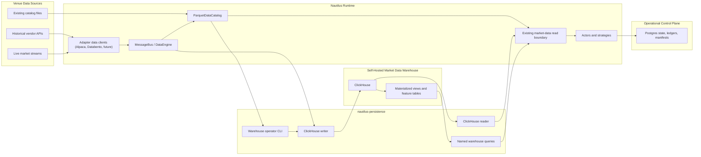
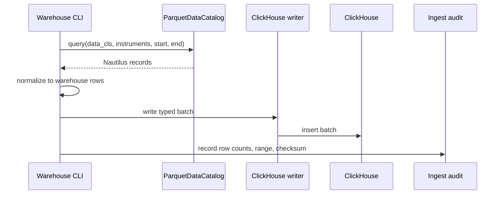

# Market Data Warehouse Workstream

Status: proposed separate workstream.

This document describes a fundamental market-data warehouse architecture for this fork. It is not an
Alpaca adapter feature: Alpaca is only the first producer and validation consumer. The warehouse
belongs beside the catalog as a repo-level analytical persistence backend.

The workstream is separate from the Nautilus-native opportunity scanning workstream: scanners and
strategies may consume warehouse features, but this workstream owns market-data persistence,
backfill, query, and quality concerns.

The design keeps upstream Nautilus storage boundaries intact:

- `ParquetDataCatalog` remains the canonical Nautilus market-data store for replay and backtesting.
- Postgres remains the slim operational control plane for strategy state, candidate evidence,
  performance ledgers, candidate outcomes, and small ingest manifests.
- ClickHouse becomes the dual-written analytical warehouse for high-volume quotes, trades, bars,
  Greeks, and scanner feature tables.

The target rollout is **dual-write, explicit cutover**: market data is written to both the catalog
and ClickHouse, while standard reads stay catalog-backed until an operator switches supported reads
to ClickHouse through a simple configuration flag.

## Goals

- Provide fast SQL access to intraday quotes, trades, bars, and option Greeks.
- Dual-write canonical market data to `ParquetDataCatalog` and ClickHouse.
- Introduce ClickHouse as a generic repo-level persistence capability, not an adapter-local path.
- Support scanner and research queries that are awkward or expensive against many catalog files.
- Slim Postgres back to operational state and small audit records by moving market-data-shaped
  caches and analytics payloads to the catalog or ClickHouse.
- Keep replay and backtests catalog-native unless a future upstream-compatible abstraction exists.
- Allow historical backfill from `ParquetDataCatalog` and live ClickHouse mirroring from the
  Nautilus data bus.
- Support a controlled read cutover from catalog-backed reads to ClickHouse-backed reads behind a
  feature/configuration flag.
- Preserve Nautilus timestamp, instrument, price, and quantity semantics without lossy conversion.

## Non-Goals

- Do not replace `ParquetDataCatalog` as the replay or backtest authority.
- Do not move candidate ledgers, strategy state, or broker evidence out of Postgres as their source
  of truth.
- Do not keep bulk market data, backtest market payload caches, or scanner feature time series in
  Postgres once ClickHouse is available.
- Do not make ClickHouse part of order submission, execution reconciliation, or risk admission.
- Do not put ClickHouse clients, migrations, deployment, or query contracts under an adapter-owned
  namespace.
- Do not let Alpaca-specific historical loaders define the warehouse contract; adapters should feed
  normalized Nautilus model data into the repo-level warehouse boundary.
- Do not make ClickHouse the default read path until parity checks, freshness, latency, and rollback
  policy are explicit.

## Storage Responsibilities

| Store | Ownership | Primary Workloads | Notes |
| --- | --- | --- | --- |
| `ParquetDataCatalog` | Canonical Nautilus market data | Backtests, replay, catalog slices, portable archives | Uses Nautilus schemas and remains the source for engine-compatible historical data. |
| ClickHouse | Self-hosted analytical market-data warehouse and flagged read source | Intraday SQL, scanner features, liquidity analysis, rollups, dashboards, controlled read cutover | Optimized for append-heavy columnar analytics, not transactional state. |
| Postgres | Operational control plane and evidence | Strategy state, candidate ledger, performance ledger, candidate outcomes, ingest manifests | Keep small mutable state, relational constraints, and audit records here. Do not use it as a market-data warehouse. |

## Repository Ownership

ClickHouse is a fundamental database layer, so ownership must stay outside adapter code.

| Concern | Owner | Notes |
| --- | --- | --- |
| ClickHouse client, row mapping, writers, readers | `nautilus-persistence` behind an optional feature such as `clickhouse` or `warehouse-clickhouse` | Accepts Nautilus model types and emits generic warehouse rows. |
| ClickHouse schema and migrations | `schema/sql/clickhouse/` plus the warehouse operator `migrate` command | Uses generic market namespaces such as `market.quote_ticks`, not adapter-owned schemas. Applied migration metadata lives in `warehouse.schema_migrations`. |
| Self-hosted ClickHouse deployment | `deploy/warehouse/` | Alpaca deployment can depend on it later, but should not own it. |
| Warehouse operator CLI | Generic repo-level binary or existing CLI subcommand with `migrate`, `health`, `backfill`, and `validate` operations | Reads `ParquetDataCatalog`, writes ClickHouse, and validates selected datasets/ranges. |
| Live warehouse sink | Repo-level data/persistence integration | Subscribes to standard Nautilus market-data flow and writes ClickHouse asynchronously. |
| Adapter integrations | Adapter crates | Produce normalized Nautilus `QuoteTick`, `TradeTick`, `Bar`, and `OptionGreeks`; no source-specific warehouse schema in the initial implementation. |
| Scanner/research queries | Repo-level warehouse query module or CLI | Exposes named queries; consumers do not scatter one-off ClickHouse SQL. |

## Implementation Guardrails

- Build a ClickHouse backend, not a generic multi-database abstraction. Add abstractions only after
  two real warehouse backends need the same interface.
- Keep one durable warehouse operator surface for `health`, `migrate`, `backfill`, and `validate`.
  Do not add throwaway scripts or adapter-local commands for normal warehouse work.
- Keep database tooling direct. Use `sqlx` migrations for Postgres only; use the official
  ClickHouse Rust client for ClickHouse access. Do not introduce SeaORM, Diesel, or a generic ORM
  layer for this workstream.
- Keep runtime reads simple: `catalog` or `clickhouse`. Do not add hidden fallback reads, background
  comparison reads, or per-call switches unless a production consumer proves the need.
- Keep scanners and strategies away from raw SQL. They should consume named query functions or the
  existing market-data read boundary.
- Keep source-specific raw tables out of the first implementation. Add them only when a concrete
  audit/debug/research consumer and retention policy exist.
- Keep ClickHouse off the order path. Warehouse write failures create lag and operator evidence;
  they do not block order submission or reconciliation.
- Keep `ParquetDataCatalog` the replay/backtest authority. ClickHouse can accelerate analytics and
  selected reads, but it should not become the only copy of replay-critical data.

## ClickHouse Schema Management

ClickHouse schema changes should use a small repo-owned migration path, not an adapter-local script
and not a generic ORM stack. `sqlx` is the right migration manager for Postgres, but it does not
manage ClickHouse. The initial warehouse migration path should be:

- Store versioned ClickHouse SQL files under `schema/sql/clickhouse/`, starting with
  `001_market_quote_ticks.sql`.
- Apply those files through the warehouse operator `migrate` command using the official ClickHouse
  Rust client.
- Record applied version, description, checksum, and timestamp in `warehouse.schema_migrations`.
  This is warehouse control metadata, not market data and not Alpaca-owned state.
- Treat `market` as the canonical market-data database. Runtime and deployment defaults should set
  `CLICKHOUSE_DATABASE`/`CLICKHOUSE_DB` to `market`; `warehouse` is reserved for operator metadata.
- Make migration files idempotent where ClickHouse DDL allows it, and fail closed on checksum drift
  for an already-applied version.
- Revisit an external schema tool such as Atlas only if ClickHouse schema complexity outgrows this
  thin operator command. Do not add it in the first implementation pass.

## Clean Storage Boundary

The target architecture keeps each store boring and narrow.

Postgres stays because it is the right tool for small operational records that benefit from
transactions, uniqueness, and simple point reads. It should not grow into a second market-data
system.

Keep in Postgres:

- `sqlx` migration metadata: operational schema versioning for Postgres.
- `strategy_state`: mutable runtime state and restart continuity.
- `strategy_state_events`: append-only strategy-state mutation audit.
- `candidate_ledger`: candidate decisions, blocks, submissions, and evidence keys.
- `performance_ledger`: performance records and report inputs.
- `candidate_outcome`: observed outcomes tied back to candidates.
- `runtime_lease`: DB-visible live-submit writer guard.
- `ingest_manifest`: small dual-write/backfill control records, if implemented as a relational
  table.

Move out of Postgres once ClickHouse exists:

- Bulk quote, trade, bar, and Greeks payloads.
- Backtest market-data cache payloads such as option bars, option trades, and stock bars.
- Scanner feature snapshots and time-series metrics.
- Raw vendor response archives, if a concrete audit/debug/research consumer justifies a raw/source
  warehouse schema.

Preferred replacements:

- Use `ParquetDataCatalog` for replay/backtest-compatible market data.
- Use ClickHouse for high-volume analytical market data and feature time series.
- Do not mirror candidate/performance ledgers into ClickHouse initially. Add analytical mirrors only
  when a reporting consumer needs them; Postgres remains the source of truth for those records.

Postgres cleanup after ClickHouse proof: `backtest_market_cache` is retired. Market-data-shaped
cache entries now belong in the catalog and ClickHouse; tiny operational checkpoints should use a
name that describes the operational responsibility instead of reviving a broad market-cache table.

The detailed operational Postgres plan lives in
`alpaca_operational_postgres_plan.md`. That plan owns strategy-state snapshots, state-event
durability, runtime leases, migrations, and live-submit readiness. This warehouse workstream owns
catalog/ClickHouse market-data persistence and uses Postgres only for small ingest manifests.

## Recommended Architecture



The safest first implementation still proves ClickHouse with historical backfill before live
cutover. Once the schema and validation are boring, live ingestion should write both stores. Reads
remain catalog-backed by default until an explicit validation command proves a dataset/range and an
operator switches that supported read path to ClickHouse.

Alpaca option-chain data is the first practical proof dataset because it is already driving scanner
work in this fork. It must not define the architecture boundary: the writer, reader, schemas,
migrations, deployment, and read-source flag should be generic Nautilus warehouse components.

ClickHouse is self-hosted for this workstream. The repo-level deployment home should be
`deploy/warehouse/`, not `deploy/alpaca/`. Managed ClickHouse is not the planned operating model;
the remaining deployment decision is whether the first production instance lives on the NUC with
strict resource limits or on a dedicated self-hosted analytics box.

The first deployment slice is intentionally only the generic ClickHouse service, persistent volumes,
local-only ports, and smoke command under `deploy/warehouse/`. Schema migrations, data writers, and
reader cutover stay in later warehouse tasks so the deploy baseline does not become an adapter-local
proof script.

## Database Decision

Use ClickHouse as the repo-level analytical market-data warehouse. Its `MergeTree` family stores
data in sorted parts and supports efficient partition pruning and primary-key range scans. Official
guidance also recommends large insert batches, idempotent retries with consistent batches, and async
inserts when client-side batching is not feasible.

Use ClickHouse for:

- Quote and trade history.
- Option quote, trade, and Greeks history.
- Derived feature tables such as latest BBO, spread percentiles, rolling liquidity, and candidate
  scan features.
- Dashboards and research queries over many instruments and days.

Avoid ClickHouse for:

- Strategy state requiring transactional updates.
- Order/execution truth.
- Small mutable ledgers where Postgres is simpler and safer.

Do not implement TimescaleDB, DuckDB, or QuestDB paths in this workstream. DuckDB can remain a local
research tool over catalog Parquet files, but it is not a service dependency and should not shape the
warehouse code.

References:

- [ClickHouse MergeTree](https://clickhouse.com/docs/engines/table-engines/mergetree-family/mergetree)
- [ClickHouse insert guidance](https://clickhouse.com/docs/guides/inserting-data)
- [ClickHouse materialized views](https://clickhouse.com/docs/materialized-views)
- [ClickHouse TTL](https://clickhouse.com/docs/guides/developer/ttl)
- [ClickHouse Rust client](https://clickhouse.com/docs/integrations/rust)

## Self-Hosted Operations Baseline

The first production ClickHouse deployment should be self-hosted and treated as analytics
infrastructure adjacent to the trading stack, not as part of the order/execution critical path.

Baseline requirements:

- Run ClickHouse with dedicated data and log volumes, not inside the catalog directory.
- Put explicit CPU, memory, and disk limits around the service before placing it on the NUC.
- Prefer a dedicated analytics host if expected quote/trade retention threatens live trading
  headroom.
- Restrict network access to the trading host, operator host, and approved research clients.
- Keep ClickHouse credentials out of committed config and local docs.
- Add basic backup/restore coverage for schema, ingest manifests, and any non-reconstructable
  feature tables.
- Treat raw market data as reconstructable from catalog plus vendor backfill where possible.
- Monitor disk free space, insert lag, failed batches, part count, query latency, and service health.
- Document stop/start/upgrade/rollback commands before using ClickHouse as a read source.

The NUC can be the first self-hosting target only if a sizing pass confirms enough spare disk,
memory, and CPU. If ClickHouse competes with live trading processes, move it to a dedicated
self-hosted box before enabling live dual-write by default.

## Data Contracts

All warehouse tables should preserve source data in a form that can be traced back to Nautilus
records. Prefer raw fixed-point values and explicit precision columns over pre-rounded floating
point values.

Common fields:

| Field | Meaning |
| --- | --- |
| `ts_event` | Venue or market event timestamp in UTC nanosecond precision. |
| `ts_init` | Nautilus initialization/receipt timestamp in UTC nanosecond precision. |
| `instrument_id` | Nautilus instrument identifier string. |
| `venue` | Venue portion or adapter source where useful for partition/query filtering. |
| `source` | Source system or adapter such as `alpaca`, `databento`, or another future data source. |
| `ingest_run_id` | Backfill or live sink run identifier for lineage. |

Operator validation over ClickHouse must be range-bounded. `validate-quotes` should include
`--start-ns` and `--end-ns` so queries can prune by the `event_date` partition instead of scanning
the full quote table. Use ingest-run-specific smoke commands for tiny write/read checks.

Initial ClickHouse table sketches:

```sql
CREATE TABLE market.quote_ticks
(
    ts_event DateTime64(9, 'UTC'),
    ts_init DateTime64(9, 'UTC'),
    instrument_id LowCardinality(String),
    venue LowCardinality(String),
    source LowCardinality(String),
    bid_price_raw Int64,
    ask_price_raw Int64,
    bid_size_raw UInt64,
    ask_size_raw UInt64,
    price_precision UInt8,
    size_precision UInt8,
    ingest_run_id UUID
)
ENGINE = MergeTree
PARTITION BY toYYYYMMDD(ts_event)
ORDER BY (instrument_id, ts_event, ts_init);
```

```sql
CREATE TABLE market.trade_ticks
(
    ts_event DateTime64(9, 'UTC'),
    ts_init DateTime64(9, 'UTC'),
    instrument_id LowCardinality(String),
    venue LowCardinality(String),
    source LowCardinality(String),
    price_raw Int64,
    size_raw UInt64,
    aggressor_side LowCardinality(String),
    trade_id String,
    price_precision UInt8,
    size_precision UInt8,
    ingest_run_id UUID
)
ENGINE = MergeTree
PARTITION BY toYYYYMMDD(ts_event)
ORDER BY (instrument_id, ts_event, ts_init);
```

```sql
CREATE TABLE market.option_greeks
(
    ts_event DateTime64(9, 'UTC'),
    ts_init DateTime64(9, 'UTC'),
    instrument_id LowCardinality(String),
    venue LowCardinality(String),
    underlying LowCardinality(String),
    source LowCardinality(String),
    convention LowCardinality(String),
    delta Float64,
    gamma Float64,
    vega Float64,
    theta Float64,
    rho Float64,
    mark_iv Nullable(Float64),
    bid_iv Nullable(Float64),
    ask_iv Nullable(Float64),
    underlying_price Nullable(Float64),
    open_interest Nullable(Float64),
    ingest_run_id UUID
)
ENGINE = MergeTree
PARTITION BY toYYYYMMDD(ts_event)
ORDER BY (underlying, instrument_id, ts_event, ts_init);
```

Keep bars in a separate table keyed by `bar_type`:

```sql
CREATE TABLE market.bars
(
    ts_event DateTime64(9, 'UTC'),
    ts_init DateTime64(9, 'UTC'),
    bar_type LowCardinality(String),
    instrument_id LowCardinality(String),
    source LowCardinality(String),
    open_raw Int64,
    high_raw Int64,
    low_raw Int64,
    close_raw Int64,
    volume_raw UInt64,
    price_precision UInt8,
    size_precision UInt8,
    ingest_run_id UUID
)
ENGINE = MergeTree
PARTITION BY toYYYYMMDD(ts_event)
ORDER BY (bar_type, instrument_id, ts_event);
```

These sketches are starting contracts, not final migrations. Before implementation, validate field
names against the current Nautilus Arrow schemas and source adapter data shapes.

## Ingestion Modes

### Dual-Write Contract

Live market data should be dispatched to both storage paths:

- `ParquetDataCatalog` remains the primary engine-compatible write target.
- ClickHouse receives the same normalized data as an analytical mirror.
- Each batch records lineage with a shared `ingest_run_id`, source, dataset, instrument range, time
  range, row count, and checksum where practical.
- A ClickHouse write failure should not stop order handling by default. It should mark warehouse lag
  and rely on retry/backfill to repair the gap.
- Catalog write failure is more serious because it threatens replay and audit continuity; treat it
  according to the owning runtime's durability policy.

Maintain an ingest manifest so dual-write state is observable. Prefer Postgres for this manifest
because it is small operational control state, not market data. Early local commands may print
counts and checksums, but do not introduce a second manifest format that can become permanent.

```text
IngestManifest
  dataset
  source
  instrument_id or universe key
  start_ts_event
  end_ts_event
  ingest_run_id
  catalog_status
  clickhouse_status
  row_count
  checksum
  first_ts_event
  last_ts_event
  completed_at
```

The manifest is the operational answer to "did both stores receive the same range?"

### Catalog Backfill

Backfill reads `ParquetDataCatalog` files and writes ClickHouse batches through the repo-level
warehouse writer. The operator surface should be generic, not Alpaca-owned.



Backfill requirements:

- Idempotent ranges by `data_cls`, `instrument_id`, `start`, `end`, and `source`.
- Run-level lineage through `ingest_run_id`.
- Row counts per instrument and day.
- Retryable batches grouped by ClickHouse partition.
- Validation against catalog query counts before marking a range complete.
- Source-specific historical APIs can fill catalog gaps first, but the ClickHouse backfill path reads
  from catalog data so the warehouse does not encode adapter-specific loader behavior.

### Live Warehouse Sink

The live sink subscribes to standard Nautilus market-data messages and writes ClickHouse rows
asynchronously through the same repo-level writer. In the final write model it runs alongside
catalog persistence, not instead of it.

Live sink requirements:

- Feature gated until validated, then enabled as part of the standard market-data persistence stack.
- Lives outside adapter-specific code; adapters provide normalized model events.
- Batches rows by count, bytes, and time.
- Fails open for trading by default: ClickHouse downtime should not stop order handling.
- Emits lag, dropped row, retry, and batch-size metrics.
- Records enough lineage to reconcile live warehouse rows with catalog streaming output.

Do not add a durable warehouse queue initially. If live gaps cannot be repaired from the catalog or
vendor backfill, revisit a queue as a separate architecture decision. Do not make the strategy hot
path block directly on warehouse inserts.

## Read Cutover

ClickHouse reads should be introduced by an explicit read-source flag after a separate validation
command proves the supported dataset/range. Keep this simple: no parallel production read path and no
hidden comparison mode in normal scanner or strategy execution.

Suggested read modes:

| Mode | Behavior | Use |
| --- | --- | --- |
| `catalog` | Read from `ParquetDataCatalog`. | Default and rollback mode. |
| `clickhouse` | Read from ClickHouse for supported datasets. | Controlled cutover after validation and freshness SLOs hold. |

Start with a coarse runtime setting, then split only if a real consumer needs finer control:

```text
market_data_read_source = "catalog" | "clickhouse"
```

Cutover requirements:

- The ClickHouse reader supports the same instrument/time filters as the catalog reader for the
  promoted dataset.
- A validation command passes sampled row count, timestamp range, and price/size checksum checks.
- ClickHouse freshness lag is within the configured SLO for the scanner or strategy using it.
- Operators can roll back to `catalog` without schema changes or data migration.
- Candidate evidence records the read source and feature timestamp when ClickHouse-derived features
  affect ranking or admission.

## Query and Feature Layer

ClickHouse should expose derived read models for scanners and research. Examples:

- Latest quote by instrument.
- Daily quote coverage by instrument.
- Spread percentile by instrument and time window.
- Trade count and notional buckets.
- Option chain liquidity by underlying, expiration, and strike.
- Greeks snapshots joined to quote BBO by instrument and timestamp.
- Candidate feature snapshots keyed by strategy profile and scan time.

Use ClickHouse materialized views for stable high-volume rollups. Use ordinary views or ad hoc
queries for exploratory work until query patterns settle.

Do not let scanners depend on one-off SQL strings scattered through binaries. Add named query
functions in the warehouse module or operator CLI only when scanner consumers are real.

## Retention and Lifecycle

Suggested default policy:

- Raw quotes/trades: keep hot for a short operational window, then move or expire according to cost.
- Bars and Greeks: keep longer because they are lower volume and useful for research.
- Feature snapshots: keep according to model-development needs, not forever by default.
- Catalog data: retain according to replay/backtest requirements, independent of ClickHouse TTL.

ClickHouse TTL should align with the time partition key so partitions can be dropped efficiently.
Do not delete catalog data because ClickHouse has a retention policy.

## Validation

Minimum validation before enabling a dataset for scanner use:

- Source catalog row count equals warehouse row count for sampled ranges.
- Dual-write manifest shows catalog and ClickHouse completion for the same ingest range.
- `ts_event` and `ts_init` are monotonic per source batch where Nautilus expects monotonic data.
- No nulls in required identity fields.
- Price and size raw values round-trip to expected decimal values.
- Duplicate policy is explicit for `(instrument_id, ts_event, ts_init)` collisions.
- Freshness lag is measured for live sink output.
- Explicit read-validation checks pass before switching any consumer to `clickhouse` mode.

For scanner features:

- Recompute a sampled feature from raw rows and compare to materialized output.
- Record query version or feature version with candidate evidence when the feature affects ranking.

## Phased Work Breakdown

| Phase | Outcome | Work | Done when |
| --- | --- | --- | --- |
| 1. ADR and contracts | Storage boundaries are durable. | Finalize repo-level ownership, table contracts, duplicate policy, retention policy, and feature consumers. | ADR/doc names ClickHouse as analytical warehouse owned outside adapters and keeps catalog/Postgres responsibilities intact. |
| 2. Self-hosted ClickHouse dev stack | Reproducible warehouse sandbox. | Add `deploy/warehouse/` ClickHouse startup config, `schema/sql/clickhouse/` migrations, resource limits, and operator smoke commands. | The warehouse operator can apply migrations and run a trivial insert/query locally without using Alpaca deployment files. |
| 3. Generic ClickHouse persistence boundary | `nautilus-persistence` can write/read warehouse rows. | Add optional ClickHouse client feature, typed row mapping for `QuoteTick` first, health/smoke APIs, and migration support used by the operator. | A small Rust smoke writes and reads `QuoteTick` rows through `nautilus-persistence`. |
| 4. Catalog backfill proof | Warehouse data from existing catalog. | Build the generic warehouse `backfill` operation for quotes first, with row counts and run audit output. | A sampled catalog date/instrument range loads into ClickHouse and validates counts. Alpaca catalog data may be the first proof dataset. |
| 5. Dual-write live sink | Both stores receive live market data. | Subscribe to standard Nautilus market-data flow, batch ClickHouse inserts, keep catalog writes in place, and record manifest parity. | Live ingestion writes catalog and ClickHouse, and ClickHouse outages surface as warehouse lag instead of trading failures. |
| 6. Scanner query proof | Read-only scanner feature surface. | Add named queries for latest BBO, spread/liquidity windows, and coverage checks. | A scanner diagnostic can read warehouse features without touching live order flow. |
| 7. Read validation command | Cutover proof without a runtime comparison mode. | Add an explicit operator command that compares catalog and ClickHouse for requested dataset/range and reports counts, timestamp range, checksum, and freshness. | Operators can prove a supported read range before changing runtime config. |
| 8. Flagged ClickHouse read cutover | Controlled read switch. | Promote supported datasets to `clickhouse` mode with explicit rollback to `catalog`. | Operators can switch reads to ClickHouse and back to catalog by configuration. |
| 9. Dataset expansion | More generic market data coverage. | Add trades, bars, option Greeks, and option-chain liquidity features after quote ticks prove the path. | Research can query generic market datasets by instrument/source/time and option features by underlying, expiration, strike, and time. |
| 10. Postgres slimming | Operational store is narrow. | Follow `alpaca_operational_postgres_plan.md`; keep market-data cache payloads and scanner feature time series in catalog/ClickHouse; keep Postgres for state, events, ledgers, outcomes, leases, and ingest manifests. | `backtest_market_cache` is retired and no active code writes market-data payloads to Postgres. |
| 11. Export to catalog | Replay-compatible bridge. | Export warehouse-selected ranges back into `ParquetDataCatalog` format when needed. | Backtests still consume catalog data, even if ClickHouse selected or prepared the range. |

## Provisional Answers

These decisions are strong enough to guide the first implementation pass. Revisit them only when
real volume, latency, or operational evidence contradicts them.

| Question | Provisional answer | Reason |
| --- | --- | --- |
| Write model | Write market data to both `ParquetDataCatalog` and ClickHouse. Catalog remains the primary engine-compatible store during the initial rollout. | This gives ClickHouse analytical coverage while preserving Nautilus replay/backtest continuity. |
| Code ownership | Add ClickHouse support to `nautilus-persistence` behind an optional feature. Keep adapter crates as producers of normalized Nautilus model data. | ClickHouse is a fundamental analytical backend, not an Alpaca feature. |
| Postgres role | Keep Postgres as the operational control plane: strategy state snapshots, state events, decision/evidence ledgers, outcomes, runtime leases, and ingest manifests. Do not use it for bulk market data. | Postgres gives clean transactional semantics for small mutable records; ClickHouse and the catalog are better homes for high-volume market data. |
| First production source | Use existing `ParquetDataCatalog` files for historical backfill first. Source-specific historical APIs can fill catalog gaps before ClickHouse backfill, but ClickHouse should ingest from catalog-shaped Nautilus data. | This preserves Nautilus schemas and avoids adapter-specific warehouse loaders with subtly different semantics. |
| Option and underlying quotes | Store all normalized `QuoteTick`-shaped BBO data in one `market.quote_ticks` table. Add instrument metadata or views for option-specific filtering. | Underlying and option BBO rows have the same core query shape: instrument, event time, bid, ask, sizes. One table simplifies joins, coverage checks, and scanner queries. |
| Source-specific raw payloads | Out of scope for the initial implementation. Add raw/source tables only with an explicit consumer, schema migration, and retention policy. | Canonical `market.*` tables should mirror Nautilus semantics first; raw vendor archives are easy to add and hard to retire. |
| Initial dataset scope | Prove generic quote ticks first. The first proof window can use the configured Alpaca scanner universe and option contracts the scanner scores, but the schema and writer must remain source-neutral. Add trades, bars, Greeks, and wider history after quote coverage and query shape are boring. | Quotes are the first analytical need for spread/liquidity windows, and starting from scored contracts keeps the first ClickHouse pass measurable without making Alpaca the boundary. |
| Initial freshness target | For backfill and scanner research, end-of-run consistency is enough. For the live dual-write sink, target data visible within one scan interval, with an initial practical SLO of p95 under 60 seconds and p99 under 5 minutes. | This keeps the warehouse useful for scanner features without turning it into a hard real-time trading dependency. |
| Read cutover | Start in `catalog` mode. Prove ClickHouse with an explicit validation command, then promote supported datasets to `clickhouse` mode by flag. | This keeps runtime behavior simple while preserving rollback. |
| Read flag config surface | Start with one coarse market-data read-source flag with `catalog` and `clickhouse` modes. Split by dataset or consumer only after a real need appears. | A single flag is easier to operate and avoids call-site-specific switches during the first migration. |
| Trade-gating freshness | Do not use warehouse freshness as a trade gate before the flagged ClickHouse read path has passed explicit validation. If a strategy eventually depends on ClickHouse-derived features for entry, record feature timestamp and lag with the candidate decision. | Live order admission should rely on Nautilus cache/live data until the warehouse sink has proven reliability and latency. |
| Duplicate handling | Start with plain `MergeTree` tables plus an ingest manifest, not `ReplacingMergeTree`. Treat `(dataset, source, instrument_id, start, end)` as an idempotent load range. | ClickHouse duplicate removal is eventual and can leak duplicates into normal queries. Job-level idempotency is easier to reason about for canonical market data. |
| Backfill reloads | Prefer full-day partition loads. Load into staging, validate counts, then replace or promote the partition/range through the warehouse operator surface. | Partition-level replacement is cleaner than row-level mutations and avoids ad hoc development-only delete paths. |
| Schema and migrations location | Put ClickHouse DDL under `schema/sql/clickhouse/` and apply it with the warehouse operator `migrate` command. Keep canonical tables generic. Add raw/source schemas only through explicit migrations after the canonical path proves insufficient. | Market-data warehouse schema is not adapter-owned. Source adapters can own extraction, while the warehouse owns normalized contracts. |
| Migration tooling | Use `sqlx` migrations for Postgres operational storage. Use the warehouse operator plus the official ClickHouse Rust client for ClickHouse migrations. Defer Atlas or any external schema manager until the thin operator path is clearly insufficient. | This avoids a custom Postgres migration system while also avoiding ORM/tooling bloat for ClickHouse. |
| Postgres cleanup | `backtest_market_cache` is retired once ClickHouse and catalog writes cover those datasets. Add operational state events and migrations in Postgres before live submit cutover. Do not mirror ledgers to ClickHouse until a reporting consumer needs analytical copies. | This removes the broad JSONB market cache path and keeps a clean split between operational truth and analytical history. |
| First runtime integration | Build the generic `nautilus-persistence` ClickHouse writer and warehouse `backfill` operation before turning on the live dual-write sink. | It validates contracts and scanner usefulness before introducing a new live-service dependency. |
| Deployment owner | Self-host ClickHouse from `deploy/warehouse/`. Start with a local/dev stack, then prove the NUC only if storage, CPU, and memory headroom are acceptable. Move to a dedicated self-hosted analytics box if retention or ingest volume outgrows the NUC. | Quote-scale data can outgrow a small live-trading host quickly, and the warehouse must not starve trading processes. |

## Remaining Open Questions

- Exact self-host target and retention budget: local NUC or dedicated analytics host should be
  decided after sizing expected quote/trade volume and disk retention.
- First proof window: choose the initial instrument list and date range before implementation so row
  counts, storage size, and backfill runtime are measurable.
- Trade-gating warehouse reads: if ClickHouse-derived features later gate live orders, define a
  tighter freshness SLO and an explicit fail-open/fail-closed policy for partial or stale reads.

## Immediate Implementation Slice

Start with the smallest repo-level path that proves ClickHouse is a real warehouse backend:

1. Add `deploy/warehouse/compose.yml` for local/self-hosted ClickHouse with persistent data/log
   volumes, resource limits, local-only ports by default, and smoke commands.
2. Add `schema/sql/clickhouse/001_market_quote_ticks.sql` for the initial canonical
   `market.quote_ticks` table plus warehouse migration metadata.
3. Add optional ClickHouse support to `nautilus-persistence`, including config, connection health,
   and a typed `QuoteTick` row mapper.
4. Add a durable warehouse operator surface with `health`, `migrate`, `backfill`, and `validate`
   operations. `migrate` applies `schema/sql/clickhouse/` files, records applied versions in
   `warehouse.schema_migrations`, and fails on checksum drift. The first smoke should write a tiny
   `QuoteTick` batch and read counts back through the same surface.
5. Validate with a small catalog-backed proof window. Alpaca option-chain catalog data can be the
   first dataset, but no ClickHouse module, migration, command, or deployment file should carry an
   Alpaca-owned name.

## Design Preference

Start with catalog backfill and scanner read models. Then enable live dual-write once validation and
operator visibility are boring. Keep reads catalog-backed until an explicit validation command proves
ClickHouse parity for the supported dataset/range, then cut over with a simple flag and an easy
rollback.

The architectural rule is simple: **catalog for replay, Postgres for slim operational control,
ClickHouse for analytics and flagged read cutover**.
