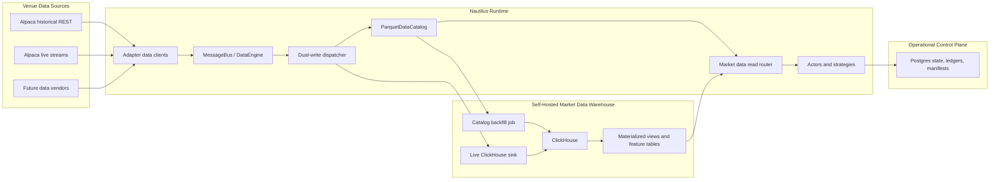
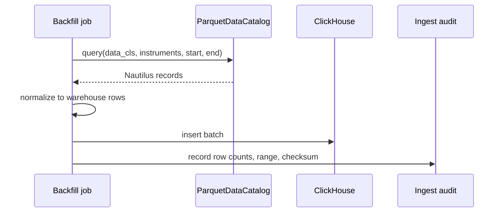

# Market Data Warehouse Workstream

Status: proposed separate workstream.

This document describes a market-data warehouse architecture for this fork. It is separate from the
Nautilus-native opportunity scanning workstream: scanners and strategies may consume warehouse
features, but this workstream owns market-data persistence, backfill, query, and quality concerns.

The design keeps upstream Nautilus storage boundaries intact:

- `ParquetDataCatalog` remains the canonical Nautilus market-data store for replay and backtesting.
- Postgres remains the slim operational control plane for Alpaca strategy state, candidate evidence,
  performance ledgers, candidate outcomes, and ingest manifests.
- ClickHouse becomes the dual-written analytical warehouse for high-volume quotes, trades, bars,
  Greeks, and scanner feature tables.

The target rollout is **dual-write, phased-read**: market data is written to both the catalog and
ClickHouse, while standard reads stay catalog-backed until a later cutover enables ClickHouse reads
through an explicit configuration flag.

## Goals

- Provide fast SQL access to intraday quotes, trades, bars, and option Greeks.
- Dual-write canonical market data to `ParquetDataCatalog` and ClickHouse.
- Support scanner and research queries that are awkward or expensive against many catalog files.
- Slim Postgres back to operational state and small audit records by moving market-data-shaped
  caches and analytics payloads to the catalog or ClickHouse.
- Keep replay and backtests catalog-native unless a future upstream-compatible abstraction exists.
- Allow historical backfill from `ParquetDataCatalog` and live ClickHouse mirroring from the
  Nautilus data bus.
- Support a controlled read cutover from catalog-backed reads to ClickHouse-backed reads behind a
  feature/configuration flag.
- Preserve Nautilus timestamp, instrument, price, and quantity semantics without lossy conversion.

## Non-Goals

- Do not replace `ParquetDataCatalog` as the replay or backtest authority.
- Do not move candidate ledgers, strategy state, or broker evidence out of Postgres as their source
  of truth.
- Do not keep bulk market data, backtest market payload caches, or scanner feature time series in
  Postgres once ClickHouse is available.
- Do not make ClickHouse part of order submission, execution reconciliation, or risk admission.
- Do not build a generic storage framework before the Alpaca market-data use case proves it needs
  one.
- Do not make ClickHouse the default read path until parity checks, freshness, latency, and fallback
  policy are explicit.

## Storage Responsibilities

| Store | Ownership | Primary Workloads | Notes |
| --- | --- | --- | --- |
| `ParquetDataCatalog` | Canonical Nautilus market data | Backtests, replay, catalog slices, portable archives | Uses Nautilus schemas and remains the source for engine-compatible historical data. |
| ClickHouse | Self-hosted analytical market-data warehouse and flagged read source | Intraday SQL, scanner features, liquidity analysis, rollups, dashboards, controlled read cutover | Optimized for append-heavy columnar analytics, not transactional state. |
| Postgres | Operational control plane and evidence | Strategy state, candidate ledger, performance ledger, candidate outcomes, ingest manifests | Keep small mutable state, relational constraints, and audit records here. Do not use it as a market-data warehouse. |
| DuckDB | Local research helper | Ad hoc SQL over catalog Parquet files | Useful for notebooks and one-off analysis; not a service dependency. |

## Clean Storage Boundary

The target architecture keeps each store boring and narrow.

Postgres stays because it is the right tool for small operational records that benefit from
transactions, uniqueness, and simple point reads. It should not grow into a second market-data
system.

Keep in Postgres:

- `strategy_state`: mutable runtime state and restart continuity.
- `candidate_ledger`: candidate decisions, blocks, submissions, and evidence keys.
- `performance_ledger`: performance records and report inputs.
- `candidate_outcome`: observed outcomes tied back to candidates.
- `ingest_manifest`: small dual-write/backfill control records, if implemented as a relational
  table.

Move out of Postgres once ClickHouse exists:

- Bulk quote, trade, bar, and Greeks payloads.
- Backtest market-data cache payloads such as option bars, option trades, and stock bars.
- Scanner feature snapshots and time-series metrics.
- Raw vendor response archives that are useful for analytics or replay preparation.

Preferred replacements:

- Use `ParquetDataCatalog` for replay/backtest-compatible market data.
- Use ClickHouse for high-volume analytical market data and feature time series.
- Use optional ClickHouse mirrors of candidate/performance ledgers only for analytics; Postgres
  remains the source of truth for those records.

Deletion proposal after ClickHouse is live: retire or heavily narrow Postgres
`backtest_market_cache`. If a cache entry is really market data, write it through the catalog and
ClickHouse. If it is a tiny operational checkpoint, rename it to match that responsibility instead
of keeping a broad market-cache table.

## Recommended Architecture



The safest first implementation still proves ClickHouse with historical backfill before live
cutover. Once the schema and validation are boring, live ingestion should write both stores. Reads
remain catalog-backed by default, then move through a shadow-compare mode before ClickHouse becomes
the active read source.

ClickHouse is self-hosted for this workstream. Managed ClickHouse is not the planned operating
model; the remaining deployment decision is whether the first production instance lives on the NUC
with strict resource limits or on a dedicated self-hosted analytics box.

## Database Options

### ClickHouse

ClickHouse is the preferred warehouse for quote/trade scale. Its `MergeTree` family stores data in
sorted parts and supports efficient partition pruning and primary-key range scans. Official guidance
also recommends large insert batches, idempotent retries with consistent batches, and async inserts
when client-side batching is not feasible.

Use ClickHouse for:

- Quote and trade history.
- Option quote, trade, and Greeks history.
- Derived feature tables such as latest BBO, spread percentiles, rolling liquidity, and candidate
  scan features.
- Dashboards and research queries over many instruments and days.

Avoid ClickHouse for:

- Strategy state requiring transactional updates.
- Order/execution truth.
- Small mutable ledgers where Postgres is simpler and safer.

References:

- [ClickHouse MergeTree](https://clickhouse.com/docs/engines/table-engines/mergetree-family/mergetree)
- [ClickHouse insert guidance](https://clickhouse.com/docs/guides/inserting-data)
- [ClickHouse materialized views](https://clickhouse.com/docs/materialized-views)
- [ClickHouse TTL](https://clickhouse.com/docs/guides/developer/ttl)
- [ClickHouse Rust client](https://clickhouse.com/docs/integrations/rust)

### TimescaleDB

TimescaleDB is the simpler Postgres-compatible alternative. It keeps familiar SQL clients,
extensions, and operational patterns while adding time-series hypertables, compression, rollups, and
retention.

Use TimescaleDB if operational simplicity matters more than quote-scale OLAP throughput. It is a
reasonable fallback for lower-volume bars, scanner feature snapshots, or deployments where running
ClickHouse is too much operational surface.

Reference: [TigerData / TimescaleDB docs](https://www.tigerdata.com/docs)

### DuckDB

DuckDB is best treated as a local analytical tool over the existing Parquet catalog. It can query
Parquet files directly and supports ASOF joins, which are useful for finance research.

Use DuckDB for:

- Notebook research.
- Local data profiling.
- One-off Parquet analysis.
- Validating ClickHouse backfill output against source catalog files.

References:

- [DuckDB querying Parquet](https://duckdb.org/docs/current/guides/file_formats/query_parquet)
- [DuckDB ASOF joins](https://duckdb.org/docs/current/guides/sql_features/asof_join)

### QuestDB

QuestDB is purpose-built for low-latency time-series workloads and has finance-friendly SQL
extensions such as `SAMPLE BY`, `LATEST ON`, and `ASOF JOIN`. It is worth revisiting if the dominant
workload becomes low-latency tick analytics rather than broad OLAP and materialized feature tables.

For this fork, prefer ClickHouse first because it has stronger fit for append-heavy analytical
warehousing, materialized views, Parquet/S3 interoperability, and mature operational patterns.

Reference: [QuestDB docs](https://questdb.com/docs/)

## Self-Hosted Operations Baseline

The first production ClickHouse deployment should be self-hosted and treated as analytics
infrastructure adjacent to the trading stack, not as part of the order/execution critical path.

Baseline requirements:

- Run ClickHouse with dedicated data and log volumes, not inside the catalog directory.
- Put explicit CPU, memory, and disk limits around the service before placing it on the NUC.
- Prefer a dedicated analytics host if expected quote/trade retention threatens live trading
  headroom.
- Restrict network access to the trading host, operator host, and approved research clients.
- Keep ClickHouse credentials out of committed config and local docs.
- Add basic backup/restore coverage for schema, ingest manifests, and any non-reconstructable
  feature tables.
- Treat raw market data as reconstructable from catalog plus vendor backfill where possible.
- Monitor disk free space, insert lag, failed batches, part count, query latency, and service health.
- Document stop/start/upgrade/rollback commands before using ClickHouse as a read source.

The NUC can be the first self-hosting target only if a sizing pass confirms enough spare disk,
memory, and CPU. If ClickHouse competes with live trading processes, move it to a dedicated
self-hosted box before enabling live dual-write by default.

## Data Contracts

All warehouse tables should preserve source data in a form that can be traced back to Nautilus
records. Prefer raw fixed-point values and explicit precision columns over pre-rounded floating
point values.

Common fields:

| Field | Meaning |
| --- | --- |
| `ts_event` | Venue or market event timestamp in UTC nanosecond precision. |
| `ts_init` | Nautilus initialization/receipt timestamp in UTC nanosecond precision. |
| `instrument_id` | Nautilus instrument identifier string. |
| `venue` | Venue portion or adapter source where useful for partition/query filtering. |
| `source` | Source system such as `alpaca`. |
| `ingest_run_id` | Backfill or live sink run identifier for lineage. |

Initial ClickHouse table sketches:

```sql
CREATE TABLE market.quote_ticks
(
    ts_event DateTime64(9, 'UTC'),
    ts_init DateTime64(9, 'UTC'),
    instrument_id LowCardinality(String),
    venue LowCardinality(String),
    source LowCardinality(String),
    bid_price_raw Int64,
    ask_price_raw Int64,
    bid_size_raw UInt64,
    ask_size_raw UInt64,
    price_precision UInt8,
    size_precision UInt8,
    ingest_run_id UUID
)
ENGINE = MergeTree
PARTITION BY toYYYYMMDD(ts_event)
ORDER BY (instrument_id, ts_event, ts_init);
```

```sql
CREATE TABLE market.trade_ticks
(
    ts_event DateTime64(9, 'UTC'),
    ts_init DateTime64(9, 'UTC'),
    instrument_id LowCardinality(String),
    venue LowCardinality(String),
    source LowCardinality(String),
    price_raw Int64,
    size_raw UInt64,
    aggressor_side LowCardinality(String),
    trade_id String,
    price_precision UInt8,
    size_precision UInt8,
    ingest_run_id UUID
)
ENGINE = MergeTree
PARTITION BY toYYYYMMDD(ts_event)
ORDER BY (instrument_id, ts_event, ts_init);
```

```sql
CREATE TABLE market.option_greeks
(
    ts_event DateTime64(9, 'UTC'),
    ts_init DateTime64(9, 'UTC'),
    instrument_id LowCardinality(String),
    underlying LowCardinality(String),
    source LowCardinality(String),
    delta Float64,
    gamma Float64,
    vega Float64,
    theta Float64,
    rho Float64,
    implied_volatility Float64,
    underlying_price_raw Int64,
    open_interest Nullable(UInt64),
    price_precision UInt8,
    ingest_run_id UUID
)
ENGINE = MergeTree
PARTITION BY toYYYYMMDD(ts_event)
ORDER BY (underlying, instrument_id, ts_event, ts_init);
```

Keep bars in a separate table keyed by `bar_type`:

```sql
CREATE TABLE market.bars
(
    ts_event DateTime64(9, 'UTC'),
    ts_init DateTime64(9, 'UTC'),
    bar_type LowCardinality(String),
    instrument_id LowCardinality(String),
    source LowCardinality(String),
    open_raw Int64,
    high_raw Int64,
    low_raw Int64,
    close_raw Int64,
    volume_raw UInt64,
    price_precision UInt8,
    size_precision UInt8,
    ingest_run_id UUID
)
ENGINE = MergeTree
PARTITION BY toYYYYMMDD(ts_event)
ORDER BY (bar_type, instrument_id, ts_event);
```

These sketches are starting contracts, not final migrations. Before implementation, validate field
names against the current Nautilus Arrow schemas and Alpaca option data shapes.

## Ingestion Modes

### Dual-Write Contract

Live market data should be dispatched to both storage paths:

- `ParquetDataCatalog` remains the primary engine-compatible write target.
- ClickHouse receives the same normalized data as an analytical mirror.
- Each batch records lineage with a shared `ingest_run_id`, source, dataset, instrument range, time
  range, row count, and checksum where practical.
- A ClickHouse write failure should not stop order handling by default. It should mark warehouse lag
  and rely on retry/backfill to repair the gap.
- Catalog write failure is more serious because it threatens replay and audit continuity; treat it
  according to the owning runtime's durability policy.

Maintain an ingest manifest so dual-write state is observable. Prefer Postgres for this manifest
because it is small operational control state, not market data. A local audit file is acceptable
only for early development before the Postgres-backed manifest exists.

```text
IngestManifest
  dataset
  source
  instrument_id or universe key
  start_ts_event
  end_ts_event
  ingest_run_id
  catalog_status
  clickhouse_status
  row_count
  checksum
  first_ts_event
  last_ts_event
  completed_at
```

The manifest is the operational answer to "did both stores receive the same range?"

### Catalog Backfill

Backfill reads `ParquetDataCatalog` files and writes ClickHouse batches.



Backfill requirements:

- Idempotent ranges by `data_cls`, `instrument_id`, `start`, `end`, and `source`.
- Run-level lineage through `ingest_run_id`.
- Row counts per instrument and day.
- Retryable batches grouped by ClickHouse partition.
- Validation against catalog query counts before marking a range complete.

### Live ClickHouse Sink

The live sink subscribes to Nautilus market-data messages and writes ClickHouse rows
asynchronously. In the final write model it runs alongside catalog persistence, not instead of it.

Live sink requirements:

- Feature gated until validated, then enabled as part of the standard market-data persistence stack.
- Batches rows by count, bytes, and time.
- Fails open for trading by default: ClickHouse downtime should not stop order handling.
- Emits lag, dropped row, retry, and batch-size metrics.
- Records enough lineage to reconcile live warehouse rows with catalog streaming output.

If live durability becomes critical, introduce a durable queue between Nautilus and ClickHouse. Do
not make the strategy hot path block directly on warehouse inserts.

## Read Cutover

ClickHouse reads should be introduced by an explicit read-source flag after dual-write parity is
observable. Use a narrow flag rather than changing call sites opportunistically.

Suggested read modes:

| Mode | Behavior | Use |
| --- | --- | --- |
| `catalog` | Read from `ParquetDataCatalog`. | Default and rollback mode. |
| `shadow_compare` | Use catalog results for decisions, query ClickHouse in parallel, and record count/checksum/freshness differences. | Cutover rehearsal and parity checks. |
| `clickhouse` | Read from ClickHouse for supported datasets, with an explicit fallback policy. | Controlled cutover after parity and freshness SLOs hold. |

Start with a coarse runtime setting, then narrow to dataset-specific flags if needed:

```text
market_data_read_source = "catalog" | "shadow_compare" | "clickhouse"
market_data_read_fallback = "catalog" | "none"
```

Cutover requirements:

- The ClickHouse reader supports the same instrument/time filters as the catalog reader for the
  promoted dataset.
- `shadow_compare` passes sampled row count, timestamp range, and price/size checksum checks.
- ClickHouse freshness lag is within the configured SLO for the scanner or strategy using it.
- Operators can roll back to `catalog` without schema changes or data migration.
- Candidate evidence records the read source and feature timestamp when ClickHouse-derived features
  affect ranking or admission.

## Query and Feature Layer

ClickHouse should expose derived read models for scanners and research. Examples:

- Latest quote by instrument.
- Daily quote coverage by instrument.
- Spread percentile by instrument and time window.
- Trade count and notional buckets.
- Option chain liquidity by underlying, expiration, and strike.
- Greeks snapshots joined to quote BBO by instrument and timestamp.
- Candidate feature snapshots keyed by strategy profile and scan time.

Use ClickHouse materialized views for stable high-volume rollups. Use ordinary views or ad hoc
queries for exploratory work until query patterns settle.

Do not let scanners depend on one-off SQL strings scattered through binaries. Add a small query
module or CLI surface with named query methods once scanner consumers are real.

## Retention and Lifecycle

Suggested default policy:

- Raw quotes/trades: keep hot for a short operational window, then move or expire according to cost.
- Bars and Greeks: keep longer because they are lower volume and useful for research.
- Feature snapshots: keep according to model-development needs, not forever by default.
- Catalog data: retain according to replay/backtest requirements, independent of ClickHouse TTL.

ClickHouse TTL should align with the time partition key so partitions can be dropped efficiently.
Do not delete catalog data because ClickHouse has a retention policy.

## Validation

Minimum validation before enabling a dataset for scanner use:

- Source catalog row count equals warehouse row count for sampled ranges.
- Dual-write manifest shows catalog and ClickHouse completion for the same ingest range.
- `ts_event` and `ts_init` are monotonic per source batch where Nautilus expects monotonic data.
- No nulls in required identity fields.
- Price and size raw values round-trip to expected decimal values.
- Duplicate policy is explicit for `(instrument_id, ts_event, ts_init)` collisions.
- Freshness lag is measured for live sink output.
- `shadow_compare` read checks pass before switching any consumer to `clickhouse` mode.

For scanner features:

- Recompute a sampled feature from raw rows and compare to materialized output.
- Record query version or feature version with candidate evidence when the feature affects ranking.

## Phased Work Breakdown

| Phase | Outcome | Work | Done when |
| --- | --- | --- | --- |
| 1. ADR and contracts | Storage boundaries are durable. | Finalize store ownership, table contracts, duplicate policy, retention policy, and feature consumers. | ADR/doc names ClickHouse as analytical warehouse and keeps catalog/Postgres responsibilities intact. |
| 2. Self-hosted ClickHouse dev stack | Reproducible warehouse sandbox. | Add documented local/self-host ClickHouse startup config, schema migrations, resource limits, and operator smoke commands. | A developer can create the schema and run a trivial insert/query locally. |
| 3. Catalog backfill proof | Warehouse data from existing catalog. | Build a backfill command for quotes/trades first, with row counts and run audit output. | A sampled catalog date/instrument range loads into ClickHouse and validates counts. |
| 4. Dual-write live sink | Both stores receive live market data. | Subscribe to data bus, batch ClickHouse inserts, keep catalog writes in place, and record manifest parity. | Live ingestion writes catalog and ClickHouse, and ClickHouse outages surface as warehouse lag instead of trading failures. |
| 5. Scanner query proof | Read-only scanner feature surface. | Add named queries for latest BBO, spread/liquidity windows, and coverage checks. | A scanner diagnostic can read warehouse features without touching live order flow. |
| 6. Shadow compare read path | Cutover rehearsal. | Add a read-source flag with `catalog`, `shadow_compare`, and `clickhouse` modes; implement parity reporting. | `shadow_compare` uses catalog for decisions and reports ClickHouse differences for sampled datasets. |
| 7. Flagged ClickHouse read cutover | Controlled read switch. | Promote supported datasets to `clickhouse` mode with explicit fallback and rollback. | Operators can switch reads to ClickHouse and back to catalog by configuration. |
| 8. Option data expansion | Option-specific tables and features. | Add bars, option Greeks, and option-chain liquidity features. | Candidate research can query option chain features by underlying, expiration, strike, and time. |
| 9. Postgres slimming | Operational store is narrow. | Move market-data cache payloads and scanner feature time series to catalog/ClickHouse; keep Postgres for state, ledgers, outcomes, and ingest manifests. | `backtest_market_cache` is retired or narrowed to non-market operational checkpoints. |
| 10. Export to catalog | Replay-compatible bridge. | Export warehouse-selected ranges back into `ParquetDataCatalog` format when needed. | Backtests still consume catalog data, even if ClickHouse selected or prepared the range. |

## Provisional Answers

These decisions are strong enough to guide the first implementation pass. Revisit them only when
real volume, latency, or operational evidence contradicts them.

| Question | Provisional answer | Reason |
| --- | --- | --- |
| Write model | Write market data to both `ParquetDataCatalog` and ClickHouse. Catalog remains the primary engine-compatible store during the initial rollout. | This gives ClickHouse analytical coverage while preserving Nautilus replay/backtest continuity. |
| Postgres role | Keep Postgres as the operational control plane: strategy state, decision/evidence ledgers, outcomes, and ingest manifests. Do not use it for bulk market data. | Postgres gives clean transactional semantics for small mutable records; ClickHouse and the catalog are better homes for high-volume market data. |
| First production source | Use existing `ParquetDataCatalog` files for historical backfill first. Use Alpaca historical REST only to fill catalog gaps, then write those filled ranges to both stores. | This preserves Nautilus schemas and avoids two independent historical loaders with subtly different semantics. |
| Option and underlying quotes | Store all normalized `QuoteTick`-shaped BBO data in one `market.quote_ticks` table. Add instrument metadata or views for option-specific filtering. | Underlying and option BBO rows have the same core query shape: instrument, event time, bid, ask, sizes. One table simplifies joins, coverage checks, and scanner queries. |
| Vendor-specific option quote payloads | Put fields that do not belong to Nautilus `QuoteTick` in a separate raw/source table such as `market.alpaca_option_quote_snapshots_raw`. | The canonical warehouse tables should mirror Nautilus semantics; raw vendor tables are useful for audits and adapter debugging. |
| Initial freshness target | For backfill and scanner research, end-of-run consistency is enough. For the live dual-write sink, target data visible within one scan interval, with an initial practical SLO of p95 under 60 seconds and p99 under 5 minutes. | This keeps the warehouse useful for scanner features without turning it into a hard real-time trading dependency. |
| Read cutover | Start in `catalog` mode, rehearse with `shadow_compare`, then promote supported datasets to `clickhouse` mode by flag. | A flag keeps cutover reversible and prevents scattered call-site-specific behavior. |
| Trade-gating freshness | Do not use warehouse freshness as a trade gate before the flagged ClickHouse read path has passed shadow comparison. If a strategy eventually depends on ClickHouse-derived features for entry, record feature timestamp and lag with the candidate decision. | Live order admission should rely on Nautilus cache/live data until the warehouse sink has proven reliability and latency. |
| Duplicate handling | Start with plain `MergeTree` tables plus an ingest manifest, not `ReplacingMergeTree`. Treat `(dataset, source, instrument_id, start, end)` as an idempotent load range. | ClickHouse duplicate removal is eventual and can leak duplicates into normal queries. Job-level idempotency is easier to reason about for canonical market data. |
| Backfill reloads | Prefer full-day partition loads for production backfills. Load into staging, validate counts, then replace or promote the partition. For small development reloads, explicit delete-and-reload is acceptable. | Partition-level replacement is cleaner than row-level mutations once volume grows. Development needs a simpler escape hatch. |
| Schema and migrations location | Put ClickHouse DDL under a repo-level warehouse area such as `schema/sql/clickhouse/`. Keep Alpaca-specific loaders near the Alpaca adapter until they become generic. | Market-data warehouse schema is not Alpaca-owned long term. The adapter can own source-specific extraction while the warehouse owns normalized contracts. |
| Postgres cleanup | Retire or narrow `backtest_market_cache` once ClickHouse and catalog writes cover those datasets. Mirror ledgers to ClickHouse only for analytics, not as the source of truth. | This removes the broad JSONB market cache path and keeps a clean split between operational truth and analytical history. |
| First runtime integration | Build a catalog backfill command before turning on the live dual-write sink. | It validates contracts and scanner usefulness before introducing a new live-service dependency. |
| Deployment owner | Self-host ClickHouse. Start with a local/dev stack, then prove the NUC only if storage, CPU, and memory headroom are acceptable. Move to a dedicated self-hosted analytics box if retention or ingest volume outgrows the NUC. | Quote-scale data can outgrow a small live-trading host quickly, and the warehouse must not starve trading processes. |

## Remaining Open Questions

- Exact self-host target and retention budget: local NUC or dedicated analytics host should be
  decided after sizing expected quote/trade volume and disk retention.
- Exact live freshness SLO: keep the initial p95 under 60 seconds target unless scanner features
  become trade-gating. Trade-gating features need a tighter SLO and a fail-open/fail-closed policy.
- First dataset scope: choose the first instrument universe and date range before implementation so
  row counts, storage size, and backfill runtime are measurable.
- Exact config surface for the read flag: start with a coarse runtime flag, then split by dataset or
  consumer if the first cutover needs finer control.

## Design Preference

Start with catalog backfill and scanner read models. Then enable live dual-write once validation and
operator visibility are boring. Keep reads catalog-backed until `shadow_compare` proves ClickHouse
parity, then cut over supported reads with an explicit flag and an easy rollback.

The architectural rule is simple: **catalog for replay, Postgres for slim operational control,
ClickHouse for analytics and flagged read cutover**.
