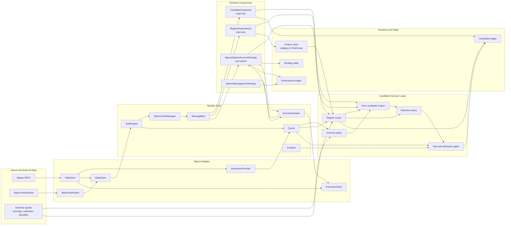
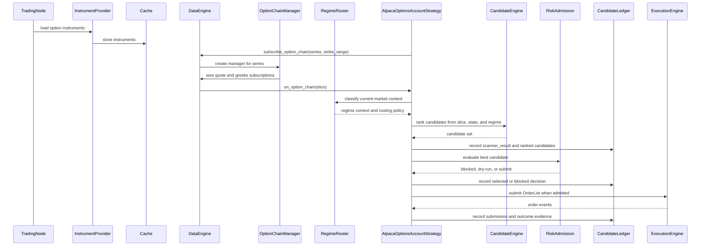

# Nautilus-Native Candidate Scanning

Status: implemented for the Alpaca Nautilus-native runtime path, with market-hours proof still
deferred. The pure candidate engine, option-chain input path, candidate evidence actor, and
`AlpacaOptionsAccountStrategy` now exist in the Rust runtime. The remaining cutover blocker is regular
market-hours paper-submit validation through the Nautilus strategy path, tracked outside this
architecture note.

This document describes the target architecture for moving Alpaca option candidate scanning toward
standard Nautilus runtime patterns. It is intentionally high level. The goal is to name the system
shape before we continue moving implementation details.

## Naming

Nautilus does not have a first-class `Scanner` component. The closest native concepts are:

- `InstrumentProvider`: discovers and loads instruments into the Nautilus cache.
- `DataClient`: requests and subscribes to market data.
- `DataEngine`: routes market data, instrument definitions, and option-chain slices.
- `Actor`: receives data, runs timers, records diagnostics, and can publish alerts.
- `Strategy`: an actor with order-management capabilities.
- `OptionChainSlice`: the native option-chain view delivered to actors and strategies.

For this project, use **candidate scanning** to mean the domain process that evaluates available
market data and produces ranked trade candidates. Use **candidate selection** for the pure scoring
and ranking logic. Use **entry strategy** for the Nautilus component that can submit orders.

## Target Shape

The target model keeps venue I/O and trading lifecycle inside Nautilus, while keeping strategy
candidate logic pure and reusable.



## Runtime Flow



## Component Responsibilities

`InstrumentProvider` owns venue instrument discovery. For options this means loading contracts,
normalizing them into Nautilus instruments, and making them visible through the cache.

`DataClient` owns market data access. It should request or subscribe to quotes, trades, greeks, and
other venue data without embedding strategy rules.

`DataEngine` and `OptionChainManager` own option-chain assembly. They should produce
`OptionChainSlice` events from cached instruments and live or replayed quote/greeks streams.

`RegimeFeatureActor` is the read-only runtime surface for regime features. It should consume
Nautilus data, query approved historical feature sources, and publish or persist normalized regime
features. It should not select strategies or submit orders.

`RegimeRouter` owns strategy-family routing from market context. It should be a pure classifier that
accepts normalized features, optional external signals, and optional portfolio context, then returns
a regime label plus strategy-family weights or blocks. It should not call Alpaca, query environment
variables, write ledgers directly from deep scoring code, or submit orders.

`CandidateEngine` owns pure candidate ranking. It should accept normalized inputs such as
`OptionChainSlice`, account-independent strategy config, regime context, and optional external
signals. It should not read environment variables, call Alpaca, submit orders, or write ledgers.

`CandidateScanActor` is the read-only runtime surface. It can run scheduled scans, publish alerts,
and record evidence, but it does not submit orders.

`AlpacaOptionsAccountStrategy` is the order-capable runtime surface. It consumes the same pure candidate
engine, applies strategy state and risk admission, then uses standard Nautilus order submission.

`OptionsManagementStrategy` owns lifecycle management for accepted entries: profit targets, stop
losses, stale orders, expiration risk, and forced flattening.

`CandidateLedger` records evidence. It should preserve scanner diagnostics, ranked candidates,
selected candidates, dry-run decisions, blocked decisions, submissions, broker responses, and later
outcomes. It is not a broker-order ledger.

## Regime Router

Nautilus already supports strategy-local regime filters through indicators and strategy code. The
Hurst/VPIN directional example is the useful precedent: it derives a Hurst regime filter from bars,
combines it with flow information, and uses the result to gate entries. The Alpaca options runtime
should generalize that pattern into a reusable strategy-family router rather than adding a generic
Nautilus `Scanner` framework.

Keep this document at the component-boundary level. The focused architecture, v1 labels, feature
contracts, routing policy, evidence shape, and rollout slices live in
[Alpaca Regime Router](alpaca_regime_router.md).

## Interfaces

The candidate engine should be shaped around small, explicit inputs and outputs:

```text
CandidateContract / CandidateMarketSnapshot
  strategy profile
  option chain slice or normalized chain snapshot
  regime context
  underlying state
  optional external signals
  optional account/risk context for ranking only

OptionsCandidateSet / candidate scan result
  scanner diagnostics
  rejection counts
  ranked candidates
  stable candidate identity keys

SelectionDecision
  no candidate
  selected dry-run candidate
  selected blocked candidate
  selected submit candidate
```

This interface keeps the math portable across live trading, backtesting, replay, CLI diagnostics,
and future Python examples.

## Streamlined Work Breakdown

Build this in small slices that keep the current Alpaca runtime usable. Each slice should either
make one piece of logic reusable or move one runtime responsibility closer to Nautilus-native
ownership.

| Slice | Outcome | Work | Done when |
| --- | --- | --- | --- |
| 1. Candidate-set boundary | Strategy input is explicit. | Replace hidden selector calls with `scan_options_candidates` and `OptionsCandidateSet` scan reports plus ranked entries. | Current account-engine strategy consumes an candidate set instead of hidden selector state. Implemented for the Alpaca account-engine path. |
| 2. Candidate engine boundary | Pure reusable scoring core. | Extract filtering, scoring, ranking, rejection counts, and candidate identity into explicit candidate-engine types below the REST scanner adapter. | Implemented in `crates/trading/src/options/candidates.rs`; current REST scanner behavior routes through the pure engine without changing operator output. |
| 3. REST input adapter | Current operations use the target input model. | Convert Alpaca contract and snapshot responses into normalized candidate inputs; update existing binaries and the options engine to consume candidate-engine types directly. | Implemented for the current Alpaca REST scanner adapter in `strategy.rs`; dry-run scans and the current options engine keep producing the same candidate and ledger evidence through the target input model. |
| 4. Option-chain input adapter | Nautilus-native market-state input. | Convert `OptionChainSlice` and cached instruments into the same candidate input model. | The same candidate engine can rank candidates from REST snapshots or `OptionChainSlice` events. |
| 5. Regime router boundary | Reusable strategy-family routing. | Add pure `RegimeInput`, `RegimeContext`, and routing-policy types with threshold-based labels and explanation codes. | Candidate ranking can accept regime context without calling venue APIs or reading operator config. |
| 6. Regime feature actor | Native feature surface. | Add a read-only actor or service that computes feature snapshots from Nautilus data, catalog/ClickHouse history, and external signals. | A scan records regime label, feature freshness, and routing decision in the candidate ledger. |
| 7. Read-only scan actor | Native scan and alert surface. | Add an `CandidateScanActor` that runs scheduled or event-driven scans, records ledgers, and publishes alerts without order submission. | One-shot and interval scans can run inside a `TradingNode` without the standalone scanner loop. |
| 8. Entry strategy | Standard order-capable path. | Add an `AlpacaOptionsAccountStrategy` that consumes candidate sets, applies regime routing, selection, and risk admission, then submits through Nautilus order flow. | Paper dry-run and paper submit paths use the strategy path instead of bespoke scanner submission glue. |
| 9. Management and cleanup | Slim runtime with fewer parallel paths. | Move close/flatten lifecycle into an `OptionsManagementStrategy`; retire one-off scanner binaries once operator commands use actor/strategy surfaces. | Active docs and operator commands point at the Nautilus-native path, with REST-only scanners kept only where they remain useful diagnostics. |

Ordering rule: do not build a new order-capable runtime surface before the candidate engine boundary
exists, and do not retire the REST scanner path until the `OptionChainSlice` path can reproduce
candidate evidence well enough for live and replay diagnostics.

Avoid adding a generic Nautilus `Scanner` framework for this work. The durable abstraction is the
candidate engine plus Nautilus actors and strategies around it.

## Current State And Next Slice

The candidate-engine extraction and Nautilus-native runtime wiring are now in place for Alpaca
options. The direct refactor replaced REST-shaped scoring dependencies with owned candidate-engine
types, and the order-capable entry owner is now `AlpacaOptionsAccountStrategy` rather than the retired
account-engine entry loop.

Target model:

- `CandidateEngine` is pure. It ranks option candidates from normalized inputs and returns
  scanner diagnostics, rejection counts, and ranked candidates.
- Alpaca REST contract and snapshot loading is input acquisition, not strategy logic.
- `OptionChainSlice` support feeds the same candidate engine without going through Alpaca REST
  scoring types.
- `OptionsCandidateSet` remains the strategy-facing output for read-only actor diagnostics and
  order-capable entry strategy decisions.

Implemented refactor:

1. Introduced normalized candidate input types for option contracts, quotes, greeks, and liquidity:
   `CandidateContract`, `CandidateQuote`, and `CandidateMarketSnapshot`.
2. Moved filtering, scoring, candidate construction, rejection counting, and candidate identity into
   `crates/trading/src/options/candidates.rs`.
3. Moved selected-entry metadata, strategy-family names, and regime feature/routing primitives into
   `crates/trading/src/options/entries.rs` and `crates/trading/src/options/regime.rs`.
4. Replaced Alpaca REST-shaped scoring calls in the current scanner path with conversion into the
   normalized candidate input model followed by direct candidate-engine calls.
5. Deleted the displaced `strategy/scoring.rs` path instead of preserving renamed pass-through
   functions.
6. Kept ledger writes, operator events, account admission, and broker submission outside the
   candidate engine.

Current code ownership:

- `crates/trading/src/options/candidates.rs`: pure scoring and ranking module.
- `crates/trading/src/options/entries.rs`: selected option-entry metadata and strategy-family
  names.
- `crates/trading/src/options/regime.rs`: regime feature snapshots, source-neutral event-load
  inputs, and pure routing.
- `crates/adapters/alpaca/src/strategy.rs`: REST data-acquisition and input-adapter surface.
- `crates/adapters/alpaca/src/candidate_scan_actor.rs`: read-only candidate evidence actor.
- `crates/adapters/alpaca/src/options_account_strategy.rs`: order-capable Nautilus strategy owner.
- `crates/adapters/alpaca/src/options_runtime.rs`: legacy-compatible candidate-output assembly and
  supporting runtime contracts.
- `crates/adapters/alpaca/src/strategy_state_entry.rs`: Alpaca-only conversion from selected entry
  metadata into persisted strategy-state drafts.

Acceptance criteria:

- The candidate engine does not import `AlpacaHttpClient`, REST request types, environment parsing,
  storage, operator events, or broker submission modules.
- Selected-entry metadata and regime routing primitives do not import Alpaca runtime state or
  broker/account modules.
- Current REST scans and the options engine still produce the same candidate selection and ledger
  evidence for the same inputs.
- Public names describe owned concepts, such as `CandidateContract`, `CandidateMarketSnapshot`,
  `CandidateQuote`, candidate scan results, and `OptionsCandidateSet`, not temporary migration
  mechanics.
- No compatibility selectors, old-name pass-through functions, or duplicate scoring paths remain.
- Targeted validation passes with `cargo fmt -p nautilus-alpaca`,
  `cargo check -p nautilus-alpaca --features live --bins`, and
  `cargo test -p nautilus-alpaca --features live --lib`.

Next implementation slices:

1. Run the deferred market-hours cutover proof: non-submit parity first, then bounded paper submit
   through `AlpacaOptionsAccountStrategy`.
2. Implement the regime router types and read-only feature actor from the focused v1 input contract
   before wiring regime metadata into live decisions.

Still deferred:

- Market-hours Nautilus strategy submit proof.
- Market-hours validation for Alpaca option quote/trade streaming entitlements.
- Market-hours validation for standard historical option bar requests.
- Regime router type implementation, feature actor, validation, and live routing.
- Broader ClickHouse-derived scanner features.

## Migration Path

1. Make `OptionsCandidateSet` the target strategy input for the current Alpaca account engine,
   read-only scan actor, and future entry strategy.
2. Keep the existing Alpaca REST scanners as diagnostics while extracting their scoring and candidate
   builders into a pure candidate engine.
3. Add adapters from `OptionChainSlice` and cached instruments into the pure candidate input model.
4. Add the pure regime router and a read-only feature actor before wiring order-capable routing.
5. Introduce a read-only `CandidateScanActor` for candidate evidence and alerts.
6. Move order-capable entry logic into a Nautilus `Strategy` path that uses standard order factories,
   risk gates, and `ExecutionEngine` submission.
7. Retire one-off scanner binaries once the actor/strategy path gives equal or better observability.

Most of this migration path is implemented for the Alpaca runtime: the candidate engine,
option-chain scan actor, and order-capable `AlpacaOptionsAccountStrategy` now exist, and the displaced
account-engine entry loop has been retired. Regime routing remains intentionally blocked until real
feature inputs exist. Do not reintroduce account-engine entry submission or standalone scanner loops
while working on the remaining proof and analytics gaps.

## Architecture Decisions

The read-only scan actor and order-capable strategy should be separate runtime components.
`CandidateScanActor` owns discovery, diagnostics, alerts, and evidence. `AlpacaOptionsAccountStrategy`
owns order-capable decisions. They should share the candidate engine, candidate-set types, and
configuration model, but a read-only actor should not become order-capable through a submit-mode
toggle.

Ranking should remain mostly account-independent. Candidate quality should be replayable from
market data, strategy config, regime context, and explicit external signals. Account and portfolio
context can influence ranking only where it changes the economic quality of the candidate, such as
naked-option buying-power usage or portfolio-level Greek and correlation exposure. Hard controls
such as kill switches, broker permissions, duplicate underlyings, max active entries, open orders,
and account tradability belong in risk admission.

External signals should be provider-owned normalized data. Earnings calendars, allowlists, market
calendars, and similar inputs may use cached files as ingest cache and evidence, but actors and
strategies should consume normalized signal snapshots rather than read CSVs or environment-specific
files directly.

Ledger migration should preserve evidence semantics, not the old physical shape. Keep stable
candidate identity keys, scan diagnostics, ranked-candidate evidence, selected/blocked/submitted
decisions, broker response evidence, and outcome traceability. Do not let the current ledger schema
force the runtime architecture.

## Remaining Open Questions

- Exact signal delivery contract: whether provider-owned signals should enter strategies as custom
  Nautilus data, catalog-backed feature snapshots, or a small typed provider API.
- Candidate-ledger migration shape: which schema/version fields are needed so existing analysis can
  coexist with candidate-set, regime-routing, and future `TradingNode` strategy records during
  cutover.

## Design Preference

Prefer Nautilus-native runtime ownership over parallel infrastructure:

- Use providers and data clients for venue I/O.
- Use the cache and `OptionChainSlice` for market state.
- Use actors for read-only scanning and alerting.
- Use strategies for order-capable entry and management.
- Keep candidate math pure, deterministic, and replayable.
