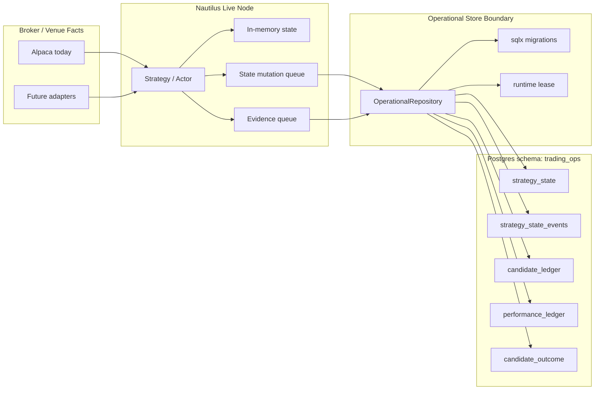

# Operational Postgres Plan

Status: implemented for the current Alpaca live-submit path; keep this as the active plan for
source-neutral operational storage changes.

Postgres is the repo-level operational control plane. It stores small, durable trading-operations
facts that need transactional writes, restart continuity, and operator visibility. It is not a
market-data warehouse; bulk quotes, trades, bars, Greeks, scanner feature series, and vendor cache
payloads belong in `ParquetDataCatalog` and ClickHouse.

## Ownership

The operational repository, migrations, schema constants, runtime leases, strategy-state helpers,
candidate ledger helpers, performance ledger helpers, and candidate-outcome helpers live under
`nautilus-infrastructure::sql::operational`.

Alpaca is the first live adapter using this layer. Alpaca may own its HTTP translation, broker
reconciliation, strategy runtime, and operator commands, but it should not own generic Postgres
repository code or schema evolution.

## Tables

| Table | Owner | Purpose |
| --- | --- | --- |
| `strategy_state` | Operational store | Current restart/admission snapshot per account. |
| `strategy_state_events` | Operational store | Append-only state mutation audit and idempotency ledger. |
| `candidate_ledger` | Operational store | Candidate, block, decision, alert, and submit-result evidence. |
| `performance_ledger` | Operational store | Realized performance report inputs. |
| `candidate_outcome` | Operational store | Candidate outcome projections for research and reports. |
| `runtime_lease` | Operational store | Exclusive active writer/submitter guard per account. |
| `ingest_manifest` | Warehouse workstream | Small backfill and dual-write control records. |

## Runtime Shape



The strategy updates in-memory state first so the running process protects itself immediately.
Durable writes flow through explicit async persistence handles. If operational persistence is
required for live submit and the repository, migration status, lease, or persistence sink is
unhealthy, the runtime must block new live submissions and emit an operator event.

## Configuration

Use source-neutral env names:

- `NAUTILUS_OPERATIONAL_DATABASE_URL`
- `NAUTILUS_OPERATIONAL_SCHEMA`, default `trading_ops`
- `NAUTILUS_OPERATIONAL_ACCOUNT_ID`, optional override

The repo-local `.env` remains the canonical local and Docker env source for the Alpaca deployment.
Do not reintroduce `ALPACA_STORAGE_*` variables or config-home-only defaults.

## Migration Policy

Use `sqlx` migrations under `crates/infrastructure/migrations/operational/`.

Do not add a custom Postgres migration manager. The infrastructure Postgres helper applies the
schema migrations and reads `_sqlx_migrations` for operator readiness. If the schema expands, add a
versioned migration and keep JSONB payloads bounded to operational evidence, not market-data
payloads.

## Clean Architecture Rules

- Keep Postgres narrow: state, events, ledgers, outcomes, leases, and small ingest manifests only.
- Keep ClickHouse source-neutral for analytical market data.
- Keep `ParquetDataCatalog` for replay/backtest compatibility.
- Keep Alpaca-specific code in the Alpaca adapter: HTTP models, account preflights, broker
  reconciliation, and operator command presentation.
- Move pure strategy, scanner, regime, and candidate primitives to a Nautilus-owned strategy crate
  when they no longer need broker-specific types.
- Do not add wrappers, shims, or compatibility envs for old Alpaca-owned storage names.

## Validation

For operational-store changes, run:

```bash
cargo check -p nautilus-infrastructure --features postgres
cargo check -p nautilus-alpaca --features live --bins
```

When deployment wiring changes, also validate the running Alpaca stack with the repo-local `.env`
and the documented Docker commands in `AGENTS.md`.
