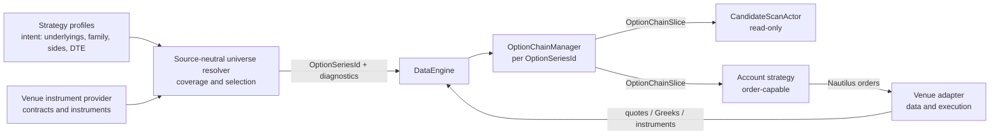

# Option Universe Ownership

Status: accepted target architecture for `nt-ryj.1`.

This decision defines ownership for live option universe construction. The boundary is
source-neutral: Alpaca is the first live proof adapter, but the model must also fit backtests,
replay, and future option venues.

## Decision

Live option universes are strategy intent resolved into concrete Nautilus option-series
subscriptions.

Strategy profiles own the intent: underlyings, strategy family, required option sides, DTE
windows, strike-range preferences, quantity, and risk-admission knobs. A source-neutral resolver
turns that intent plus available option instruments into concrete `OptionSeriesId` values and
resolution diagnostics. Venue adapters provide instruments, quotes, Greeks, and execution
translation. Once a concrete `OptionSeriesId` is selected, Nautilus `DataEngine` and
`OptionChainManager` own subscription setup, rebalancing, snapshot timing, and teardown.

Live runtime code must not use a fixed option expiry as the control plane. A single date such as
`ALPACA_OPTION_CHAIN_EXPIRY` can be useful for compare tools, historical replay, or a bounded
diagnostic run, but it must not decide the production live universe.

## Why fixed live expiry is rejected

A fixed live expiry duplicates strategy intent in the operator environment. The strategy profile
says what it wants in DTE and option-side terms, while the environment picks one concrete date that
can silently miss parts of the profile. On 2026-07-01, choosing 2026-07-06 covered only 6 of 22
configured underlyings, while 2026-07-10 covered all 22. The date was not the real bug; the bug was
making runner glue own a Nautilus trading decision.

Fixed live expiry also makes rollover ambiguous. It is unclear whether the next date should be chosen
because the old one expired, because coverage is better, because liquidity moved, or because a
strategy changed its DTE window. Those rules belong in the resolver and lifecycle policy, where they
can produce coverage diagnostics and skipped-series reasons.

## Ownership model

### Strategy profile

Owns source-neutral universe intent: underlyings, family, option sides, DTE window, strike-range
preference, quantity, and risk knobs. It does not own concrete venue expiry selection, data
subscriptions, or broker payload details.

### Option universe resolver

Owns selection semantics from intent plus available instruments to concrete `OptionSeriesId`
values, with coverage and skip reasons. It does not import Alpaca REST types, credentials, broker
order state, or `DataEngine` subscription mechanics.

### Venue adapter

Owns instrument discovery, contract normalization, quote/Greeks/trade transport, and execution
translation. It does not own strategy-family policy, live universe control, or fallback strategy
selection.

### DataEngine and OptionChainManager

Own per-series option-chain subscription lifecycle, active strike rebalancing, snapshot/raw
publishing, and teardown. They do not own strategy DTE policy or choose which series should exist.

### Scanner actor

Owns read-only scan orchestration from `OptionChainSlice` and normalized feature inputs. It does
not own broker submission or venue-specific universe discovery rules.

### Account strategy

Owns candidate arbitration, risk admission, order submission through Nautilus APIs, lifecycle
blocks, and durable strategy state. It does not own adapter payload construction or live
fixed-expiry selection.

### Backtest and replay

Own explicit historical filters, catalog ranges, and reproducible diagnostics. They do not define
live control-plane defaults.

### Operator diagnostics

Own coverage reports, compare tools, and intentionally bounded fixed-date probes. They do not own
production live universe selection.

## Target flow

## Resolver contract

The resolver is source-neutral. Its inputs are strategy profiles, the current evaluation time,
available option instruments from the cache or instrument provider, and optional source-neutral
market-calendar context. Its outputs are concrete series selections and diagnostics.

Each selected series should include:

- The profile and underlying that requested it.
- The selected `OptionSeriesId`.
- The expiration date and computed DTE.
- The required option sides that can be satisfied.
- A reason code explaining why this series was selected.

Each skipped intent should include:

- The profile, underlying, family, and requested DTE window.
- Whether no expiration existed, required sides were missing, instruments were stale, or a load cap
  prevented subscription.
- The nearest available expirations when useful for operator diagnostics.

The resolver should prefer clear, deterministic selection over broad subscription. It can choose the
best covered expiry for a profile-underlying pair, or a bounded set of expiries when the strategy
explicitly needs more than one. It should not subscribe to every expiry in a DTE window until
candidate aggregation supports complete multi-expiry cycles without mixing partial candidates from
different expiries.

## High-load constraint

The first live resolver must keep subscription pressure bounded. A DTE window can contain many
expirations across 22 underlyings, and each series can fan out into quote and Greeks subscriptions
for many strikes. Subscribing to every expiry in every DTE window would create a larger data load
than the current candidate aggregation model can interpret safely.

Until multi-expiry candidate aggregation is complete, live resolution should produce a small,
explainable set of concrete series per profile-underlying pair. If the best available expiry is
outside the target DTE window, missing required sides, or blocked by load caps, the resolver should
skip it and emit diagnostics instead of widening subscriptions silently.

## Live versus diagnostics

Live strategy-driven resolution reads strategy profiles and chooses concrete series from current
instrument availability. It reports selected and skipped coverage without requiring a magic expiry
in the environment.

Long-running live actors should refresh the universe on trade-date rollover and when a selected
series drifts outside its profile DTE window. Replacement series are requested through the same
instrument-provider path, and stale scanner series are removed with Nautilus
`unsubscribe_option_chain` once no selected profile still uses them.

Diagnostic and backtest tools may still accept an explicit expiry because their purpose is
different: compare one known chain, replay one historical slice, or investigate adapter data for one
underlying and date. Those tools should label the expiry as a filter for the diagnostic or replay
run. They must not be documented as the live runtime path.

## Migration guidance

Implementation should move in this order:

1. Introduce source-neutral intent and resolution types outside the Alpaca adapter.
2. Let the live scan actor request instruments for strategy-derived intent and resolve concrete
   `OptionSeriesId` values with the source-neutral resolver.
3. Feed resolved `OptionSeriesId` values into existing Nautilus subscription APIs owned by
   `DataEngine` and `OptionChainManager`.
4. Keep Alpaca wiring as data/provider/execution plumbing around the source-neutral model.
5. Keep explicit expiries scoped to diagnostics, compare tools, catalog filters, and replay.

Do not add live fixed-expiry flags, strategy-selection switches around fixed dates, or adapter-owned
fallback selection paths while doing this work.

## Related work

- `nt-ryj`: Make live option universe Nautilus-native.
- `nt-ryj.2`: Introduce source-neutral option universe intent and resolution model.
- `nt-ryj.3`: Expose `InstrumentsResponse`-level hooks to `DataActor`.
- [Options](../concepts/options.md): source-neutral option-chain subscription architecture.
- [Nautilus-Native Candidate Scanning](nautilus_native_candidate_scanning.md): candidate engine,
  scan actor, and account strategy boundaries.
- [Alpaca Options Account-Strategy Architecture](alpaca_options_account_strategy_architecture.md):
  Alpaca live runtime component ownership.
