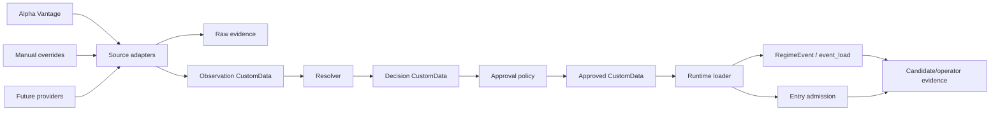

# Scheduled Event Engine

Status: accepted target architecture for earnings/event-load inputs. The current Alpaca CSV wiring
is a temporary bridge while the `ParquetDataCatalog` reader is built.

The scheduled event engine owns non-price events that affect regime routing and strategy admission:
earnings first, then market holidays, macro releases, index rebalances, dividends, manual blocks,
and similar event-load inputs. Alpaca and Alpha Vantage are the first proof path, but the model is
source-neutral.

## Decision

Use source-neutral scheduled-event custom data persisted through `ParquetDataCatalog`:

1. Source adapters fetch provider data and retain raw evidence.
2. Adapters normalize provider rows into `ScheduledEventObservation` custom data.
3. A resolver merges observations into canonical `ScheduledEventDecision` custom data.
4. Approval policy writes `ApprovedScheduledEvent` custom data.
5. Runtime loaders read approved events and supply `RegimeEvent` / `event_load` inputs plus
   entry-admission blocks.

The trading runtime must not call event providers, parse raw vendor payloads, or treat generated CSV
as the durable event contract. Existing `earnings_events.csv` and `earnings_events_approved.csv`
support is migration wiring only.

## Storage

The source of truth is a dedicated `ParquetDataCatalog` root containing registered scheduled-event
`CustomData` types. This keeps events inside Nautilus persistence and replay mechanics without
mixing them into Alpaca adapter state or Postgres.

The catalog root is configured with `NAUTILUS_SCHEDULED_EVENT_CATALOG` and defaults to:

```text
$XDG_STATE_HOME/nautilus_trader/scheduled_events/catalog
$HOME/.local/state/nautilus_trader/scheduled_events/catalog
```

Raw provider payloads are kept beside the catalog, not inside the trading contract:

```text
scheduled_events/
  raw/source=<source>/event_type=<event_type>/fetched_date=<YYYY-MM-DD>/<ingest_run_id>.<provider-format>
  catalog/data/custom/ScheduledEventObservation/...
  catalog/data/custom/ScheduledEventDecision/...
  catalog/data/custom/ApprovedScheduledEvent/...
```

Raw payloads are audit/replay evidence. Normalized observations, decisions, and approved events are
Nautilus custom data written as Parquet. Postgres may store small ingest manifests, leases, and
latest-approved watermarks; it must not become the event-fact store.

## Data Contracts

Keep the datasets explicit and narrow.

```text
ScheduledEventObservation
  observation_id
  event_type                  # earnings_report, market_holiday, macro_release, manual_block
  source                      # alpha_vantage, manual_override, future providers
  source_event_id
  underlying
  event_date
  timing                      # before_open, after_close, during_session, unknown
  timezone
  source_published_at_utc
  source_fetched_at_utc
  raw_uri
  raw_sha256
  quality_flags

ScheduledEventDecision
  canonical_event_id
  event_type
  underlying
  event_date
  timing
  status                      # confirmed, conflicted, uncertain, rejected
  confidence
  sources_used
  conflict_reason
  resolver_version
  decided_at_utc
  valid_from_utc
  valid_until_utc

ApprovedScheduledEvent
  canonical_event_id
  event_type
  underlying
  event_date
  timing
  approval_status             # approved, block_only, rejected
  source_set
  policy_version
  block_days_before
  block_days_after
  approved_at_utc
  valid_from_utc
  valid_until_utc
  diagnostic_reason
```

For earnings, unknown timing stays conservative. Earnings-targeted entries should reject unknown or
conflicted target events. Event-risk controls may still emit `block_only` so uncertainty blocks
entries without pretending the event is tradeable.

## Flow



## Ownership

Source adapters fetch provider data, write raw evidence, normalize observations, and report source
freshness. They do not approve events or encode strategy eligibility. Manual overrides are a source
adapter with provenance, not direct edits to approved output.

The resolver owns deduplication, source precedence, symbol normalization, timing normalization,
conflict detection, and confidence. If credible sources disagree inside the risk window, mark the
event `conflicted`; do not smooth disagreement into a fake neutral value.

Approval policy owns strategy-safe filters: timing requirements, weekday filters, common-symbol
filters, event windows, `block_only` behavior, and policy versioning.

The runtime loader is read-only. It queries approved custom data by `event_type`, `as_of_date`,
underlyings, and horizon, then returns approved events plus source set, policy version, coverage
window, freshness, and unavailable reason.

The regime router consumes normalized event-load inputs. It does not call providers, parse CSV, or
query the catalog. Candidate scanning remains read-only. Nautilus `DataEngine` and
`OptionChainManager` continue to own market-data subscriptions and option-chain slices.

## Migration

1. Keep current Alpaca CSV feed support only as a bridge.
2. Teach `earnings-sync` to write raw evidence plus observation, decision, and approved custom data.
3. Add the read-only approved-event loader and wire Alpaca event-load/admission through it.
4. Move status and `--check-config` to report catalog path, event count, source set, policy version,
   coverage window, freshness, and unavailable reason.
5. Remove the CSV runtime feed after live validation proves the Parquet path.

Do not add a separate earnings scanner, fixed-expiry live flags, direct provider calls from routing,
or raw CSV parsing in runtime decision code.
